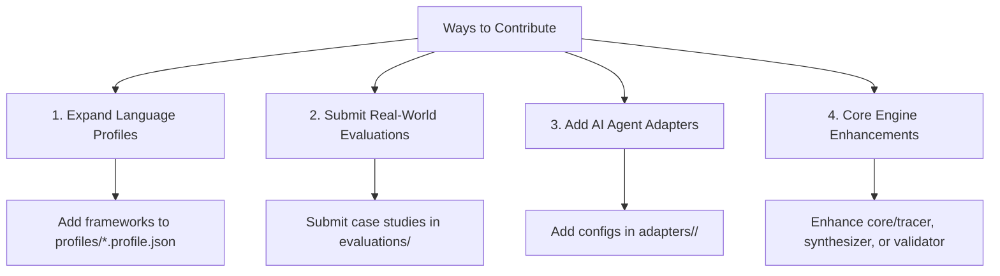

# 🤝 Contributing to UML-Architect

Thank you for your interest in contributing to **UML-Architect**!  
We welcome contributions from engineers, software architects, AI researchers, and open-source enthusiasts worldwide.

---

## 🧭 Core Architectural Philosophy

Before contributing, please keep in mind our four founding principles:

1. **Deterministic & Anti-Hallucination**: Diagrams must reflect 100% ground-truth code execution. We prefer precision over speculative guessing.
2. **Zero Runtime Dependencies**: The core runtime engine is written in native Node.js (ESM), with zero heavy third-party npm production dependencies.
3. **Self-Healing Syntax**: Output diagrams (Mermaid and PlantUML) must always be syntax-valid, resilient to broken tags, and ready to render in GitHub, VS Code, and browsers.
4. **Accessibility First (A11y)**: Visual diagrams should always be paired with structured narrative walkthroughs compliant with WCAG 2.2 AA.

---

## 🛠️ 4 Ways You Can Contribute



### 1. Expand Language & Framework Profiles (`profiles/`)
Help `uml-architect` recognize more frameworks and infrastructure components across languages:
- **Location**: [`profiles/<language>.profile.json`](./profiles/)
- **Schema Validation**: Validated against [`schema.json`](./schema.json).
- **What to add**:
  - Routing patterns (e.g., Go Fiber, Python Django, Rust Axum, Java WebFlux).
  - ORM query methods (e.g., Prisma, Hibernate, GORM, Diesel).
  - Infrastructure stereotypes: In-memory cache, Cloud storage, Message brokers, Auth services.

### 2. Submit Real-World Evaluation RFCs (`evaluations/`)
Found an enterprise controller or service where the tracer produced an incomplete flow?
- **Workflow**:
  1. Copy [`evaluations/TEMPLATE_FEEDBACK.md`](./evaluations/TEMPLATE_FEEDBACK.md).
  2. Document your real-world case study, ground-truth flow, and gaps.
  3. Submit a Pull Request.
- **Reference Example**: See [`evaluations/archive/CASE_01_LARAVEL_CACHE_S3.md`](./evaluations/archive/CASE_01_LARAVEL_CACHE_S3.md).

### 3. Add New AI Agent Adapters (`adapters/`)
`uml-architect` is designed to be agent-agnostic:
- **Location**: [`adapters/<agent_name>/`](./adapters/)
- **Current Adapters**: Antigravity, Cursor, Windsurf, Claude Code, GitHub Copilot, Cline, Continue.dev, Roo Code.
- If your favorite AI agent or IDE is missing, create a new adapter folder with the respective system prompt / rules configuration.

### 4. Enhance the Core Engine (`core/`)
- [`core/tracer.js`](./core/tracer.js): AST traversal, intra-class method crawling, cache-aside pattern recognition.
- [`core/synthesizer.js`](./core/synthesizer.js): Sequence diagrams, Mermaid `box` grouping, Flowcharts, State machines, Component diagrams.
- [`core/validator.js`](./core/validator.js): Self-healing syntax repairs for Mermaid.js and PlantUML.
- [`core/mcp_server.js`](./core/mcp_server.js): Model Context Protocol (MCP) JSON-RPC tool declarations.

---

## 💻 Local Development Setup

### Prerequisites
- **Node.js**: `>= 18.0.0`
- **Git**: Installed and configured

### Getting Started

1. **Fork and Clone the Repository**:
   ```bash
   git clone https://github.com/<your-username>/uml-architect.git
   cd uml-architect
   ```

2. **Verify Environment**:
   ```bash
   node --version # Must be >= 18.0.0
   ```

3. **Run the Automated Test Suite**:
   ```bash
   npm test
   ```
   *All tests must pass before you write new changes.*

4. **Test the CLI Locally**:
   ```bash
   node bin/uml-architect.js --help
   node bin/uml-architect.js trace --endpoint "GET /items/1/buy" --file tests/fixtures/sample_fastapi.py
   ```

5. **Test the MCP Server Locally**:
   ```bash
   npm run mcp
   ```

---

## 🧪 Testing Guidelines

Whenever you add a feature or fix a bug:
1. Add a representative fixture in [`tests/fixtures/`](./tests/fixtures/) if a new language pattern or code scenario is introduced.
2. Add corresponding assertions in [`tests/test_all.js`](./tests/test_all.js).
3. Ensure **100% of test cases pass**:
   ```bash
   npm test
   ```

---

## 📝 Commit Message Convention

We follow the [Conventional Commits](https://www.conventionalcommits.org/) specification:

| Prefix | Description | Example |
|---|---|---|
| `feat:` | A new feature or capability | `feat(tracer): add support for Go Fiber router` |
| `fix:` | A bug fix | `fix(validator): resolve unclosed box block in Mermaid` |
| `docs:` | Documentation changes | `docs(readme): add bilingual evaluation guide` |
| `test:` | Adding or improving tests | `test(fixtures): add Laravel multi-tier test case` |
| `chore:` | Maintenance tasks | `chore(release): bump version to 1.0.0` |

---

## 🚀 Pull Request (PR) Process

1. Create a dedicated branch from `main`:
   ```bash
   git checkout -b feat/my-new-feature
   ```
2. Make your changes adhering to project conventions.
3. Run test suite:
   ```bash
   npm test
   ```
4. Commit your changes with a clear message:
   ```bash
   git commit -m "feat(profile): add Django Celery recognition pattern"
   ```
5. Push to your fork and open a **Pull Request** to `main`.
6. Describe the changes, motivation, and link any relevant evaluation documents from `evaluations/`.

---

## 📜 Code of Conduct

We are committed to providing a friendly, safe, and welcoming environment for everyone, regardless of background, gender, identity, experience level, or nationality. Please treat all contributors and maintainers with respect, professionalism, and constructive empathy.

---

## 💬 Questions or Feedback?

- Open an issue on GitHub: [Issues](https://github.com/hanifalkauni/uml-architect/issues)
- Submit an evaluation RFC: [`evaluations/TEMPLATE_FEEDBACK.md`](./evaluations/TEMPLATE_FEEDBACK.md)
- Repository: [https://github.com/hanifalkauni/uml-architect](https://github.com/hanifalkauni/uml-architect)
