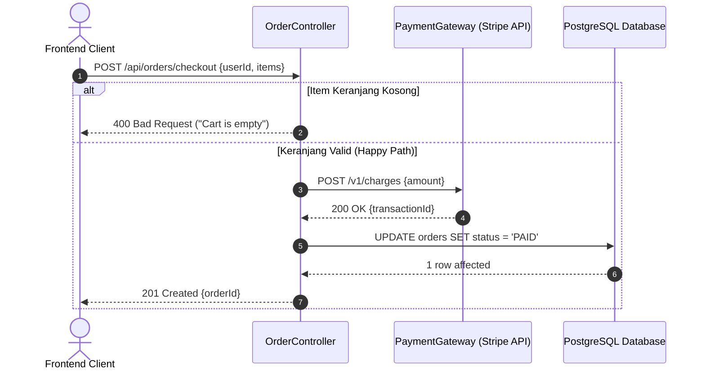

<div align="center">

# 📐 UML-Architect

**Universal Autonomous Code-to-Diagram AI Skill Agent**  
*Pembangkit otomatis Sequence Diagram, Flowchart, dan Arsitektur UML yang 100% akurat, tervalidasi sintaksnya, untuk bahasa pemrograman apa pun dan di IDE Agent mana pun.*

[](LICENSE)
[](https://nodejs.org)
[](https://mermaid.js.org)
[](https://modelcontextprotocol.io)

[English](README.md) | [Bahasa Indonesia](README.id.md)

</div>

---

## 🌟 Ringkasan

**UML-Architect** adalah skill agent AI otonom yang memecahkan masalah dokumentasi arsitektur usang (*documentation rot*). Cukup dengan memberikan **endpoint API**, **nama fungsi**, atau **path file/folder**, UML-Architect secara deterministik menelusuri seluruh alur eksekusi—dari middleware, controller, service layer, hingga transaksi database dan third-party API—lalu menghasilkan diagram UML siap pakai dalam format **Mermaid.js** dan **PlantUML**.

### Fitur Utama:
* 🌐 **Kompatibilitas Lintas IDE**: Bekerja native di **Google Antigravity**, **Cursor**, **Claude Code**, **Windsurf**, **Kiro**, **GitHub Copilot**, **Roo Code / Cline**, **Continue.dev**, dan klien **MCP**.
* 🔠 **100% Polyglot & Bebas Compiler Lokal**: Arsitektur Tri-Layer mampu membaca TypeScript, Python, Go, Java, C#, Rust, PHP, Ruby, dan bahasa lainnya tanpa mengharuskan compiler bahasa tersebut terpasang di komputer lokal.
* 🛡️ **Penelusuran Anti-Halusinasi**: Seluruh partisipan, metode, dan cabang error terbukti bersumber dari kode sumber riil.
* 🔧 **Self-Healing Mermaid Validation**: Menjamin 0% kegagalan render sintaks di viewer Markdown GitHub ataupun IDE.

---

## 🎯 Pilih Metode Integrasi Anda

UML-Architect dapat digunakan dengan 2 metode sesuai lingkungan kerja Anda:

| Fitur | Metode A: Universal MCP Server | Metode B: Pure Skill Agent / Rule File |
| :--- | :---: | :---: |
| **Butuh Node.js?** | **Ya** (Node.js >= 18.0.0 via `npx`) | **Tidak Butuh** (Zero Runtime Dependencies) 🚀 |
| **Cara Kerja** | Berjalan di background via stdio JSON-RPC | Otak bawaan LLM Agent membaca instruksi |
| **Paling Cocok Untuk** | Integrasi tool-calling otomatis & CLI | Lingkungan tanpa Node.js / Tanpa instalasi |
| **Setup** | Pasang JSON MCP di pengaturan IDE | Salin file rule `.md` ke dalam repositori |

---

## 🚀 Panduan Cepat

### 💬 Metode A: Chat AI via Server MCP (Direkomendasikan — Perlu Node.js)
Cukup pasang UML-Architect sekali saja ke pengaturan MCP IDE Anda (Cursor, Claude Desktop, Antigravity, Windsurf, Kiro, Continue.dev, dll.):
```json
{
  "mcpServers": {
    "uml-architect": {
      "command": "npx",
      "args": ["-y", "github:hanifalkauni/uml-architect", "--mcp"]
    }
  }
}
```

Setelah itu, Anda cukup menyuruh asisten AI langsung di kolom chat:
> *"@uml-architect buatkan sequence diagram untuk `POST /api/v1/orders/checkout`"*  
> *(atau: "gambarkan alur logika fungsi `processPayment()`")*

Agent akan menelusuri kode, memvalidasi sintaks, dan menyajikan diagram secara instan—**tanpa perlu mengetik perintah terminal apa pun!**

---

### 📄 Metode B: Pure Skill Agent / Rule File (Tanpa Butuh Node.js Sama Sekali)
Jika Anda **tidak memiliki Node.js** di komputer, Anda tetap bisa menggunakan UML-Architect dengan **akurasi 100%** cukup dengan menyalin file rule sesuai IDE yang Anda pakai ke dalam folder proyek Anda:

* **Google Antigravity**: Salin [`SKILL.md`](SKILL.md) ke `.agents/skills/uml-architect/SKILL.md`
* **Cursor**: Salin [`adapters/cursor/uml-architect.mdc`](adapters/cursor/uml-architect.mdc) ke `.cursor/rules/uml-architect.mdc`
* **Kiro**: Salin [`adapters/kiro/uml-architect.md`](adapters/kiro/uml-architect.md) ke `.kiro/steering/uml-architect.md`
* **Claude Code**: Salin [`adapters/claude/CLAUDE.md`](adapters/claude/CLAUDE.md) ke `CLAUDE.md`
* **Windsurf**: Salin [`adapters/windsurf/.windsurfrules`](adapters/windsurf/.windsurfrules) ke `.windsurfrules`
* **GitHub Copilot**: Salin [`adapters/copilot/copilot-instructions.md`](adapters/copilot/copilot-instructions.md) ke `.github/copilot-instructions.md`
* **Roo Code / Cline**: Salin [`adapters/cline/.clinerules`](adapters/cline/.clinerules) ke `.clinerules`

Asisten AI di IDE Anda akan langsung membaca aturan tersebut dan menganalisis kode Anda menggunakan kecerdasan internalnya—**100% tanpa instalasi apa pun!**

---

### 💻 Metode C: Lewat Terminal CLI (Untuk Skrip, CI/CD, atau Penggunaan Mandiri)
Buat diagram langsung dari terminal:
```bash
# Analisis alur dari endpoint API
npx -y github:hanifalkauni/uml-architect trace --endpoint "POST /api/v1/orders/checkout"

# Analisis alur dari fungsi tertentu
npx -y github:hanifalkauni/uml-architect function --name "processPayment" --file "src/services/payment.ts"

# (Opsional) Pasang adapter rule ke workspace proyek
npx -y github:hanifalkauni/uml-architect init
```
*(Atau gunakan `node ./bin/uml-architect.js --mcp` jika dijalankan secara lokal)*

---

## 📊 Contoh Output Visual



---

## 📜 Lisensi
MIT © [Hanif Al-Kauni](https://github.com/hanifalkauni)
