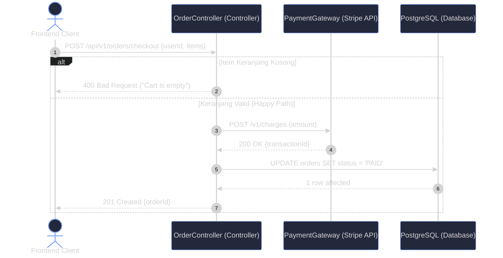
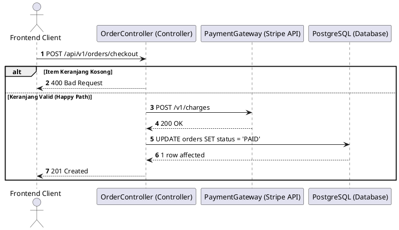

<div align="center">

# 📐 UML-Architect

**Universal Autonomous Code-to-Diagram AI Skill Agent & MCP Server**  
*Pembangkit otomatis Sequence Diagram, Flowchart, dan Arsitektur UML yang 100% akurat, tervalidasi sintaksnya, untuk bahasa pemrograman apa pun dan di AI Agent IDE mana pun.*

[](LICENSE)
[](package.json)
[](https://nodejs.org)
[](https://mermaid.js.org)
[](https://modelcontextprotocol.io)
[-success?style=for-the-badge)](package.json)
[](https://www.w3.org/WAI/standards-guidelines/wcag/)

[English](README.md) | [Bahasa Indonesia](README.id.md)

</div>

---

## 🌟 Ringkasan

**UML-Architect** adalah skill agent AI otonom yang menjembatani kenyataan kode dengan dokumentasi arsitektur perangkat lunak. Cukup dengan memberikan **endpoint API**, **nama fungsi**, atau **path file/folder**, UML-Architect secara deterministik menelusuri seluruh alur eksekusi—dari entrypoint, middleware, controller, service layer, hingga transaksi database dan third-party API—lalu menghasilkan diagram UML berkualitas publikasi dalam format **Mermaid.js** dan **PlantUML**.

### Fitur Utama:
* 🌐 **Kompatibilitas Lintas IDE**: Bekerja native di **Google Antigravity**, **Cursor**, **Claude Code**, **Windsurf**, **Kiro**, **GitHub Copilot**, **Roo Code / Cline**, **Continue.dev**, dan seluruh klien **MCP**.
* 🔠 **100% Polyglot & Bebas Compiler Lokal**: Didukung arsitektur Tri-Layer modular yang mampu membaca TypeScript, Python, Go, Java, C#, Rust, PHP, Ruby, dan bahasa lainnya tanpa mengharuskan compiler bahasa tersebut terpasang di komputer lokal.
* 🛡️ **Penelusuran Call-Graph Anti-Halusinasi**: Seluruh partisipan, panggilan metode, dan cabang error terbukti bersumber langsung dari kode sumber riil.
* 🔧 **Self-Healing Mermaid Validation**: Menjamin 0% kegagalan render sintaks di preview Markdown GitHub ataupun IDE viewer.
* ♿ **Narasi Aksesibel WCAG 2.2 AA**: Setiap diagram visual disertai narasi teks terstruktur yang ramah *screen reader* dan mudah di-review di *Git Pull Request*.

---

## 🏗️ Arsitektur Sistem

```mermaid
graph TB
    subgraph ClientLayer ["1. Layer IDE Agent Universal (Single Interface)"]
        A1["Google Antigravity<br/>(@uml-architect)"]
        A2["Cursor<br/>(.cursor/rules/*.mdc)"]
        A3["Claude Code<br/>(CLAUDE.md)"]
        A4["Windsurf<br/>(.windsurfrules)"]
        A5["VS Code / Copilot<br/>(.github/copilot-instructions)"]
        A6["Roo Code / Cline<br/>(.clinerules)"]
        A7["Universal MCP Clients<br/>(Continue.dev, Desktop, dll.)"]
        A8["CLI Runner<br/>(npx uml-architect)"]
    end

    subgraph CoreEngine ["2. Core Orchestrator & Dynamic Profile Loader"]
        M1["MCP Server Protocol & CLI Dispatcher"]
        M2["Manifest Sniffer<br/>(go.mod, pom.xml, package.json, dll.)"]
        M3["Dynamic Profile Loader (In-Memory Injector)"]
    end

    subgraph ProfilesRegistry ["3. Profil Bahasa Modular (On-Demand)"]
        P1["typescript.profile.json"]
        P2["python.profile.json"]
        P3["go.profile.json"]
        P4["jvm.profile.json"]
        P5["csharp.profile.json"]
        P6["rust.profile.json"]
        P7["php.profile.json"]
        P8["ruby.profile.json"]
        P9["generic.profile.json"]
    end

    subgraph OutputLayer ["4. Layer Sintesis & Deliverables"]
        O1["Rendered Markdown with Mermaid"]
        O2["Standalone PlantUML (.puml)"]
        O3["WCAG 2.2 AA Narrative Walkthrough"]
    end

    ClientLayer --> CoreEngine
    M1 --> M2 --> M3 --> ProfilesRegistry
    ProfilesRegistry --> OutputLayer
```



---

## 🔠 Bahasa & Framework yang Didukung

UML-Architect membaca file konfigurasi proyek (*manifest*) untuk mendeteksi rute, middleware, ORM, dan antrean asinkron secara otomatis tanpa menjalankan compiler:

| Ekosistem | File Manifest | Framework Umum yang Didukung | Ekstensi File |
| :--- | :--- | :--- | :--- |
| **Node.js / TypeScript** | `package.json` | Express, NestJS, Fastify, Hono, Koa | `.ts`, `.js`, `.mjs`, `.tsx`, `.jsx` |
| **Python** | `pyproject.toml`, `requirements.txt` | FastAPI, Django, Flask, Litestar | `.py` |
| **Go** | `go.mod` | Gin, Fiber, Echo, Chi, Standard `net/http` | `.go` |
| **Java / Kotlin** | `pom.xml`, `build.gradle` | Spring Boot, Micronaut, Quarkus, Ktor | `.java`, `.kt` |
| **C# / .NET** | `*.csproj`, `Program.cs` | ASP.NET Core Web API, Minimal APIs | `.cs` |
| **Rust** | `Cargo.toml` | Axum, Actix-web, Rocket, Warp | `.rs` |
| **PHP** | `composer.json` | Laravel, Symfony, Slim, CodeIgniter | `.php` |
| **Ruby** | `Gemfile` | Ruby on Rails, Sinatra, Hanami | `.rb` |
| **Generic Fallback** | *Semua file kode* | Pola MVC Standar, Clean Architecture, REST | *Semua file kode teks* |

---

## 🎯 Pilih Metode Integrasi Anda

UML-Architect dapat digunakan dengan 2 metode sesuai lingkungan kerja Anda:

| Fitur | Metode A: Universal MCP Server | Metode B: Pure Skill Agent / Rule File |
| :--- | :---: | :---: |
| **Butuh Node.js?** | **Ya** (Node.js >= 18.0.0 via `npx`) | **Tidak Butuh** (Zero Runtime Dependencies) 🚀 |
| **Cara Kerja** | Berjalan di background via stdio JSON-RPC | Otak bawaan LLM Agent membaca instruksi |
| **Paling Cocok Untuk** | Integrasi tool-calling otomatis & skrip CLI | Lingkungan tanpa Node.js / Tanpa instalasi |
| **Setup** | Pasang konfigurasi JSON MCP di IDE | Salin file rule `.md` ke dalam folder proyek |

---

## 🚀 Panduan Cepat

### 💬 Metode A: Chat AI via Server MCP (Direkomendasikan — Perlu Node.js)
Cukup pasang UML-Architect sekali saja ke pengaturan MCP IDE Anda (Cursor, Claude Desktop, Antigravity, Windsurf, Kiro, Continue.dev, dll.):
```json
{
  "mcpServers": {
    "uml-architect": {
      "command": "npx",
      "args": ["-y", "github:hanifalkauni/uml-architect", "--mcp"]
    }
  }
}
```

Setelah itu, Anda cukup menyuruh asisten AI langsung di kolom chat:
> *"@uml-architect buatkan sequence diagram untuk `POST /api/v1/orders/checkout`"*  
> *(atau: "gambarkan alur logika fungsi `processPayment()`")*

Agent akan menelusuri kode, memvalidasi sintaks, dan menyajikan diagram secara instan—**tanpa perlu mengetik perintah terminal apa pun!**

---

### 📄 Metode B: Pure Skill Agent / Rule File (Tanpa Butuh Node.js Sama Sekali)
Jika Anda **tidak memiliki Node.js** di komputer, Anda tetap bisa menggunakan UML-Architect dengan **akurasi 100%** cukup dengan menyalin file rule sesuai IDE yang Anda pakai ke dalam folder proyek Anda:

* **Google Antigravity**: Salin [`SKILL.md`](SKILL.md) ke `.agents/skills/uml-architect/SKILL.md`
* **Cursor**: Salin [`adapters/cursor/uml-architect.mdc`](adapters/cursor/uml-architect.mdc) ke `.cursor/rules/uml-architect.mdc`
* **Kiro**: Salin [`adapters/kiro/uml-architect.md`](adapters/kiro/uml-architect.md) ke `.kiro/steering/uml-architect.md`
* **Claude Code**: Salin [`adapters/claude/CLAUDE.md`](adapters/claude/CLAUDE.md) ke `CLAUDE.md`
* **Windsurf**: Salin [`adapters/windsurf/.windsurfrules`](adapters/windsurf/.windsurfrules) ke `.windsurfrules`
* **GitHub Copilot**: Salin [`adapters/copilot/copilot-instructions.md`](adapters/copilot/copilot-instructions.md) ke `.github/copilot-instructions.md`
* **Roo Code / Cline**: Salin [`adapters/cline/.clinerules`](adapters/cline/.clinerules) ke `.clinerules`
* **Continue.dev**: Salin [`adapters/continue/uml-architect.md`](adapters/continue/uml-architect.md) ke `.continue/rules/uml-architect.md`

Asisten AI di IDE Anda akan langsung membaca aturan tersebut dan menganalisis kode Anda menggunakan kecerdasan internalnya—**100% tanpa instalasi apa pun!**

---

### 💻 Metode C: Lewat Terminal CLI (Untuk Skrip, CI/CD, atau Penggunaan Mandiri)
Buat diagram langsung dari terminal:
```bash
# Analisis alur dari endpoint API
npx -y github:hanifalkauni/uml-architect trace --endpoint "POST /api/v1/orders/checkout"

# Analisis alur dari fungsi tertentu
npx -y github:hanifalkauni/uml-architect function --name "processPayment" --file "src/services/payment.ts"

# (Opsional) Pasang adapter rule ke workspace proyek
npx -y github:hanifalkauni/uml-architect init
```
*(Atau gunakan `node ./bin/uml-architect.js --mcp` jika dijalankan secara lokal)*

---

## 🛠️ Referensi Alat MCP (*MCP Tools*)

Saat terhubung melalui protokol MCP, UML-Architect menyediakan 7 alat bantu:

| Nama Tool | Deskripsi Fungsi | Parameter Kunci |
| :--- | :--- | :--- |
| `generate_uml_diagram` | Generator universal dari endpoint, fungsi, file, atau kueri teks | `target`, `diagram_type`, `theme`, `detail_level` |
| `trace_endpoint_flow` | Melacak siklus hidup endpoint HTTP ke Sequence Diagram | `endpoint`, `method`, `file`, `detail_level` |
| `trace_function_flow` | Melacak hierarki pemanggilan fungsi dan logika percabangan | `function_name`, `file_path`, `diagram_type` |
| `trace_path_flow` | Memetakan komponen arsitektur dari file modul atau direktori | `path`, `diagram_type` |
| `validate_mermaid_syntax` | Linter self-healing yang memperbaiki unclosed blocks dan karakter ilegal | `mermaid_code` |
| `list_supported_profiles` | Menampilkan seluruh profil bahasa modular yang aktif | *(tidak ada)* |
| `detect_project_language` | Memindai manifest proyek dan mengenali framework yang digunakan | `path` |

---

## ⚙️ Konfigurasi Proyek (`uml-architect.config.json`)

Anda dapat mengatur tema visual, level detail, dan alias kustom nama partisipan dengan meletakkan file `uml-architect.config.json` di root proyek:

```json
{
  "$schema": "./schema.json",
  "defaultDiagramType": "sequence",
  "detailLevel": "standard",
  "theme": "tokyo-night",
  "output": {
    "directory": "docs/diagrams",
    "format": ["mermaid", "markdown", "puml"],
    "includeNarrativeWalkthrough": true
  },
  "participantsAliases": {
    "AuthController": "Auth Controller",
    "JwtService": "JWT Security Provider",
    "UserRepository": "PostgreSQL (Tabel Users)"
  }
}
```

---

## 📊 Contoh Output Nyata (Standar Publikasi)

Setiap diagram yang dihasilkan UML-Architect mengikuti format Markdown baku berikut:

# UML Diagram: POST /api/v1/orders/checkout

> *Dihasilkan secara otomatis oleh **UML-Architect Skill Agent** (v1.0.0)*

### Diagram Visual


<details>
<summary>Lihat Format Alternatif (PlantUML)</summary>


</details>

### Penjelasan Alur Arsitektur (POST /api/v1/orders/checkout)

Alur eksekusi ini melibatkan **4 komponen utama**:
* **Frontend Client** (`Client`): Aplikasi mobile/web pengguna yang menginisiasi proses checkout.
* **OrderController (Controller)** (`Ctrl`): Menerima HTTP request dan memvalidasi body request.
* **PaymentGateway (Stripe API)** (`PayGW`): Layanan pihak ketiga pemroses kartu kredit.
* **PostgreSQL (Database)** (`DB`): Media persistensi data record pesanan.

#### Rincian Langkah Eksekusi:
1. **Client** mengirimkan HTTP POST berisi keranjang belanja ke **OrderController**.
2. **OrderController** memverifikasi otorisasi; jika gagal, langsung merespons dengan HTTP 400 Bad Request.
3. **OrderController** memanggil **PaymentGateway** untuk memproses transaksi pembayaran.
4. **OrderController** memperbarui status pesanan menjadi `PAID` di **PostgreSQL**.
5. **OrderController** mengembalikan respons sukses HTTP 201 Created ke pengguna.

#### Penanganan Error & Pengecualian (Error Pathways):
* **CartEmptyException (400):** Terjadi jika keranjang belanja tidak memiliki item aktif.
* **PaymentDeclinedException (402):** Terjadi bila otorisasi kartu kredit ditolak oleh gateway pembayaran.
* **DatabaseTransactionException (500):** Terjadi jika koneksi database terputus saat proses commit.

---

## 📜 Lisensi

Didistribusikan di bawah lisensi terbuka **MIT License**. Lihat [LICENSE](LICENSE) untuk detail lengkap.

```text
SPDX-License-Identifier: MIT
Copyright (c) 2026 Hanif Al-Kauni
```
