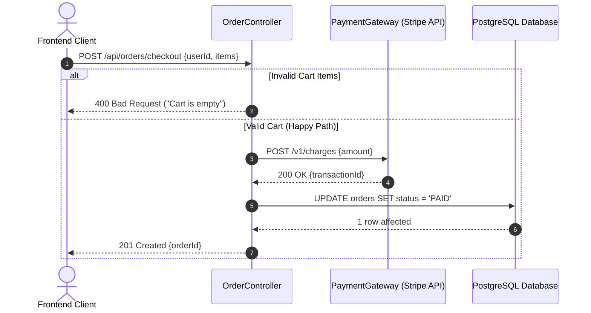

<div align="center">

# 📐 UML-Architect

**Universal Autonomous Code-to-Diagram AI Skill Agent**  
*Generate 100% accurate, syntax-validated Sequence Diagrams, Flowcharts, and Architecture UML across any programming language and any Agent IDE.*

[](LICENSE)
[](https://nodejs.org)
[](https://mermaid.js.org)
[](https://modelcontextprotocol.io)
[](https://www.w3.org/WAI/standards-guidelines/wcag/)

[English](README.md) | [Bahasa Indonesia](README.id.md)

</div>

---

## 🌟 Overview

**UML-Architect** is an autonomous specialized AI skill agent that bridges the gap between code reality and software architecture documentation. By simply providing an **API endpoint**, **function name**, or **file/module path**, UML-Architect deterministically traces the entire execution flow—from entrypoint and middlewares down to database transactions and third-party APIs—and produces publication-grade UML diagrams in **Mermaid.js** and **PlantUML**.

### Core Pillars:
* 🌐 **Universal IDE Compatibility**: Native integrations for **Google Antigravity**, **Cursor**, **Claude Code**, **Windsurf**, **Kiro**, **GitHub Copilot**, **Roo Code / Cline**, **Continue.dev**, and any **MCP Client**.
* 🔠 **100% Polyglot & Zero-Compiler Required**: Built on a Tri-Layer engine capable of reading TypeScript, Python, Go, Java, C#, Rust, PHP, Ruby, and generic languages without requiring local compilers installed.
* 🛡️ **Zero-Hallucination Call-Graph Tracing**: Every participant, method call, and error branch is proven directly from your codebase.
* 🔧 **Self-Healing Mermaid Validation**: Guarantees 0% syntax failures in GitHub Markdown previewers or IDE renderers.

---

## 🏗️ Architecture

```mermaid
graph TB
    subgraph ClientLayer ["1. Universal Agent IDE Layer (Single Interface)"]
        A1["Google Antigravity<br/>(@uml-architect)"]
        A2["Cursor<br/>(.cursor/rules/*.mdc)"]
        A3["Claude Code<br/>(CLAUDE.md)"]
        A4["Windsurf<br/>(.windsurfrules)"]
        A5["VS Code / Copilot<br/>(.github/copilot-instructions)"]
        A6["Universal MCP Clients<br/>(Continue.dev, Desktop, etc.)"]
        A7["CLI Runner<br/>(npx uml-architect)"]
    end

    subgraph CoreEngine ["2. Core Orchestrator & Dynamic Profile Loader"]
        M1["MCP Server Protocol & CLI Dispatcher"]
        M2["Manifest Sniffer<br/>(go.mod, pom.xml, package.json, etc.)"]
        M3["Dynamic Profile Loader (In-Memory Injector)"]
    end

    subgraph ProfilesRegistry ["3. Modular Language Profiles (On-Demand)"]
        P1["go.profile.json"]
        P2["jvm.profile.json"]
        P3["python.profile.json"]
        P4["typescript.profile.json"]
        P5["rust.profile.json"]
        P6["csharp.profile.json"]
        P7["generic.profile.json"]
    end

    subgraph OutputLayer ["4. Synthesis & Deliverables"]
        O1["Rendered Markdown with Mermaid"]
        O2["Standalone PlantUML (.puml)"]
        O3["WCAG 2.2 AA Narrative Walkthrough"]
    end

    ClientLayer --> CoreEngine
    M1 --> M2 --> M3 --> ProfilesRegistry
    ProfilesRegistry --> OutputLayer
```



---

## 🚀 Quick Start

### 1. One-Command Setup for your IDE
Initialize rules and configurations for all detected IDEs in your current project:
```bash
npx uml-architect init
```

### 2. Generate Diagram from API Endpoint
```bash
npx uml-architect trace --endpoint "POST /api/v1/orders/checkout"
```

### 3. Generate Diagram from Function
```bash
npx uml-architect function --name "processPayment" --file "src/services/payment.ts"
```

### 4. Run as MCP Server (Model Context Protocol)
Add this to your IDE's MCP settings:
```json
{
  "mcpServers": {
    "uml-architect": {
      "command": "node",
      "args": ["c:/MyProject/skill-agent/uml-architect/bin/uml-architect.js", "--mcp"]
    }
  }
}
```

---

## 📊 Example Output



---

## 📜 License
MIT © [Hanif Al-Kauni](https://github.com/hanifalkauni)
