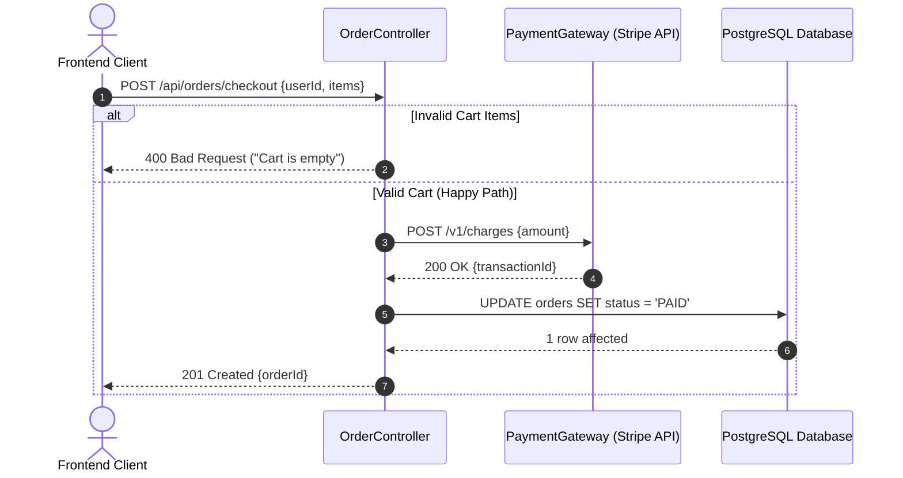

<div align="center">

# 📐 UML-Architect

**Universal Autonomous Code-to-Diagram AI Skill Agent**  
*Generate 100% accurate, syntax-validated Sequence Diagrams, Flowcharts, and Architecture UML across any programming language and any Agent IDE.*

[](LICENSE)
[](https://nodejs.org)
[](https://mermaid.js.org)
[](https://modelcontextprotocol.io)
[](https://www.w3.org/WAI/standards-guidelines/wcag/)

[English](README.md) | [Bahasa Indonesia](README.id.md)

</div>

---

## 🌟 Overview

**UML-Architect** is an autonomous specialized AI skill agent that bridges the gap between code reality and software architecture documentation. By simply providing an **API endpoint**, **function name**, or **file/module path**, UML-Architect deterministically traces the entire execution flow—from entrypoint and middlewares down to database transactions and third-party APIs—and produces publication-grade UML diagrams in **Mermaid.js** and **PlantUML**.

### Core Pillars:
* 🌐 **Universal IDE Compatibility**: Native integrations for **Google Antigravity**, **Cursor**, **Claude Code**, **Windsurf**, **Kiro**, **GitHub Copilot**, **Roo Code / Cline**, **Continue.dev**, and any **MCP Client**.
* 🔠 **100% Polyglot & Zero-Compiler Required**: Built on a Tri-Layer engine capable of reading TypeScript, Python, Go, Java, C#, Rust, PHP, Ruby, and generic languages without requiring local compilers installed.
* 🛡️ **Zero-Hallucination Call-Graph Tracing**: Every participant, method call, and error branch is proven directly from your codebase.
* 🔧 **Self-Healing Mermaid Validation**: Guarantees 0% syntax failures in GitHub Markdown previewers or IDE renderers.

---

## 🏗️ Architecture

```mermaid
graph TB
    subgraph ClientLayer ["1. Universal Agent IDE Layer (Single Interface)"]
        A1["Google Antigravity<br/>(@uml-architect)"]
        A2["Cursor<br/>(.cursor/rules/*.mdc)"]
        A3["Claude Code<br/>(CLAUDE.md)"]
        A4["Windsurf<br/>(.windsurfrules)"]
        A5["VS Code / Copilot<br/>(.github/copilot-instructions)"]
        A6["Universal MCP Clients<br/>(Continue.dev, Desktop, etc.)"]
        A7["CLI Runner<br/>(npx uml-architect)"]
    end

    subgraph CoreEngine ["2. Core Orchestrator & Dynamic Profile Loader"]
        M1["MCP Server Protocol & CLI Dispatcher"]
        M2["Manifest Sniffer<br/>(go.mod, pom.xml, package.json, etc.)"]
        M3["Dynamic Profile Loader (In-Memory Injector)"]
    end

    subgraph ProfilesRegistry ["3. Modular Language Profiles (On-Demand)"]
        P1["go.profile.json"]
        P2["jvm.profile.json"]
        P3["python.profile.json"]
        P4["typescript.profile.json"]
        P5["rust.profile.json"]
        P6["csharp.profile.json"]
        P7["generic.profile.json"]
    end

    subgraph OutputLayer ["4. Synthesis & Deliverables"]
        O1["Rendered Markdown with Mermaid"]
        O2["Standalone PlantUML (.puml)"]
        O3["WCAG 2.2 AA Narrative Walkthrough"]
    end

    ClientLayer --> CoreEngine
    M1 --> M2 --> M3 --> ProfilesRegistry
    ProfilesRegistry --> OutputLayer
```



---

## 🎯 Choose Your Integration Method

UML-Architect can be used in two ways depending on your environment:

| Feature | Method A: Universal MCP Server | Method B: Pure Skill Agent / Rule |
| :--- | :---: | :---: |
| **Node.js Required?** | **Yes** (Node.js >= 18.0.0 via `npx`) | **No** (Zero Runtime Dependencies) 🚀 |
| **How it Operates** | Runs in background via stdio JSON-RPC | LLM Agent's native reasoning engine |
| **Best For** | Full IDE tool-calling integration & CLI | Environments without Node.js |
| **Setup** | Add MCP JSON to IDE settings | Drop `.md` rule/skill file into repo |

---

## 🚀 Quick Start

### 💬 Method A: AI Agent Chat via MCP (Recommended — Requires Node.js)
Add UML-Architect directly to your AI IDE (Cursor, Claude Desktop, Google Antigravity, Windsurf, Kiro, Continue.dev, etc.) via MCP:
```json
{
  "mcpServers": {
    "uml-architect": {
      "command": "npx",
      "args": ["-y", "github:hanifalkauni/uml-architect", "--mcp"]
    }
  }
}
```

Now simply prompt your AI assistant naturally in chat:
> *"@uml-architect generate a sequence diagram for `POST /api/v1/orders/checkout`"*  
> *(or: "show me the execution flowchart for `processPayment()`")*

The agent autonomously traces your codebase, validates the syntax, and renders the diagram—**no terminal commands needed!**

---

### 📄 Method B: Pure Skill Agent / Rule File (No Node.js Required)
If you don't have Node.js installed on your machine, you can still use UML-Architect with **100% fidelity** by simply copying the rule file for your IDE into your project:

* **Google Antigravity**: Copy [`SKILL.md`](SKILL.md) to `.agents/skills/uml-architect/SKILL.md`
* **Cursor**: Copy [`adapters/cursor/uml-architect.mdc`](adapters/cursor/uml-architect.mdc) to `.cursor/rules/uml-architect.mdc`
* **Kiro**: Copy [`adapters/kiro/uml-architect.md`](adapters/kiro/uml-architect.md) to `.kiro/steering/uml-architect.md`
* **Claude Code**: Copy [`adapters/claude/CLAUDE.md`](adapters/claude/CLAUDE.md) to `CLAUDE.md`
* **Windsurf**: Copy [`adapters/windsurf/.windsurfrules`](adapters/windsurf/.windsurfrules) to `.windsurfrules`
* **GitHub Copilot**: Copy [`adapters/copilot/copilot-instructions.md`](adapters/copilot/copilot-instructions.md) to `.github/copilot-instructions.md`
* **Roo Code / Cline**: Copy [`adapters/cline/.clinerules`](adapters/cline/.clinerules) to `.clinerules`
* **Continue.dev**: Copy [`adapters/continue/uml-architect.md`](adapters/continue/uml-architect.md) to `.continue/rules/uml-architect.md`

Your AI Agent will read the rule file and analyze your codebase directly using its native intelligence—**zero installation needed!**

---

### 💻 Method C: Terminal CLI (For Scripts, CI/CD, or Standalone Use)
Generate diagrams directly from your command line:
```bash
# Trace an API endpoint
npx -y github:hanifalkauni/uml-architect trace --endpoint "POST /api/v1/orders/checkout"

# Trace a specific function
npx -y github:hanifalkauni/uml-architect function --name "processPayment" --file "src/services/payment.ts"

# (Optional) Inject IDE rule adapters into your project
npx -y github:hanifalkauni/uml-architect init
```
*(Or use `node ./bin/uml-architect.js --mcp` if developing locally)*

---

## 📊 Example Output



---

## 📜 License
MIT © [Hanif Al-Kauni](https://github.com/hanifalkauni)
