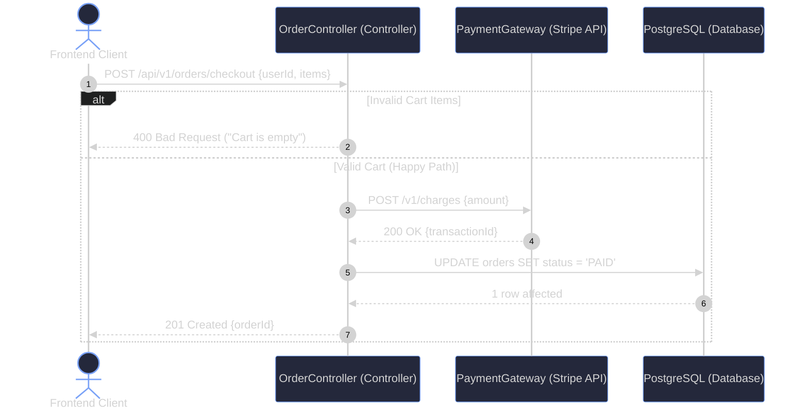
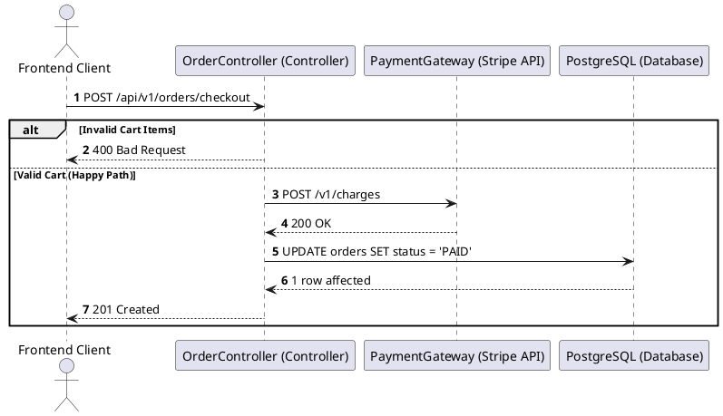

<div align="center">

# 📐 UML-Architect

**Universal Autonomous Code-to-Diagram AI Skill Agent & MCP Server**  
*Generate 100% accurate, syntax-validated Sequence Diagrams, Flowcharts, and Architecture UML across any programming language and any AI Agent IDE.*

[](LICENSE)
[](package.json)
[](https://nodejs.org)
[](https://mermaid.js.org)
[](https://modelcontextprotocol.io)
[-success?style=for-the-badge)](package.json)
[](https://www.w3.org/WAI/standards-guidelines/wcag/)

[English](README.md) | [Bahasa Indonesia](README.id.md)

</div>

---

## 🌟 Overview

**UML-Architect** is an autonomous specialized AI skill agent that bridges the gap between code reality and software architecture documentation. By simply providing an **API endpoint**, **function name**, or **file/module path**, UML-Architect deterministically traces the entire execution flow—from entrypoint and middlewares down to database transactions and third-party APIs—and produces publication-grade UML diagrams in **Mermaid.js** and **PlantUML**.

### Core Pillars:
* 🌐 **Universal IDE Compatibility**: Native integrations for **Google Antigravity**, **Cursor**, **Claude Code**, **Windsurf**, **Kiro**, **GitHub Copilot**, **Roo Code / Cline**, **Continue.dev**, and any **MCP Client**.
* 🔠 **100% Polyglot & Zero-Compiler Required**: Built on a modular Tri-Layer engine capable of reading TypeScript, Python, Go, Java, C#, Rust, PHP, Ruby, and generic languages without requiring local compilers installed.
* 🛡️ **Zero-Hallucination Call-Graph Tracing**: Every participant, method call, and error branch is proven directly from your codebase.
* 🔧 **Self-Healing Mermaid Validation**: Guarantees 0% syntax failures in GitHub Markdown previewers or IDE renderers.
* ♿ **WCAG 2.2 AA Accessible Walkthroughs**: Accompanies visual diagrams with structured textual narratives for screen readers and Git reviewability.

---

## 🏗️ Architecture

```mermaid
graph TB
    subgraph ClientLayer ["1. Universal Agent IDE Layer (Single Interface)"]
        A1["Google Antigravity<br/>(@uml-architect)"]
        A2["Cursor<br/>(.cursor/rules/*.mdc)"]
        A3["Claude Code<br/>(CLAUDE.md)"]
        A4["Windsurf<br/>(.windsurfrules)"]
        A5["VS Code / Copilot<br/>(.github/copilot-instructions)"]
        A6["Roo Code / Cline<br/>(.clinerules)"]
        A7["Universal MCP Clients<br/>(Continue.dev, Desktop, etc.)"]
        A8["CLI Runner<br/>(npx uml-architect)"]
    end

    subgraph CoreEngine ["2. Core Orchestrator & Dynamic Profile Loader"]
        M1["MCP Server Protocol & CLI Dispatcher"]
        M2["Manifest Sniffer<br/>(go.mod, pom.xml, package.json, etc.)"]
        M3["Dynamic Profile Loader (In-Memory Injector)"]
    end

    subgraph ProfilesRegistry ["3. Modular Language Profiles (On-Demand)"]
        P1["typescript.profile.json"]
        P2["python.profile.json"]
        P3["go.profile.json"]
        P4["jvm.profile.json"]
        P5["csharp.profile.json"]
        P6["rust.profile.json"]
        P7["php.profile.json"]
        P8["ruby.profile.json"]
        P9["generic.profile.json"]
    end

    subgraph OutputLayer ["4. Synthesis & Deliverables"]
        O1["Rendered Markdown with Mermaid"]
        O2["Standalone PlantUML (.puml)"]
        O3["WCAG 2.2 AA Narrative Walkthrough"]
    end

    ClientLayer --> CoreEngine
    M1 --> M2 --> M3 --> ProfilesRegistry
    ProfilesRegistry --> OutputLayer
```



---

## 🔠 Supported Languages & Frameworks

UML-Architect scans project manifests to automatically resolve routing, controller delegators, ORM calls, and async queues without running compilers:

| Ecosystem | Manifest File | Typical Frameworks Supported | File Extensions |
| :--- | :--- | :--- | :--- |
| **Node.js / TypeScript** | `package.json` | Express, NestJS, Fastify, Hono, Koa | `.ts`, `.js`, `.mjs`, `.tsx`, `.jsx` |
| **Python** | `pyproject.toml`, `requirements.txt` | FastAPI, Django, Flask, Litestar | `.py` |
| **Go** | `go.mod` | Gin, Fiber, Echo, Chi, Standard `net/http` | `.go` |
| **Java / Kotlin** | `pom.xml`, `build.gradle` | Spring Boot, Micronaut, Quarkus, Ktor | `.java`, `.kt` |
| **C# / .NET** | `*.csproj`, `Program.cs` | ASP.NET Core Web API, Minimal APIs | `.cs` |
| **Rust** | `Cargo.toml` | Axum, Actix-web, Rocket, Warp | `.rs` |
| **PHP** | `composer.json` | Laravel, Symfony, Slim, CodeIgniter | `.php` |
| **Ruby** | `Gemfile` | Ruby on Rails, Sinatra, Hanami | `.rb` |
| **Generic Fallback** | *Any source files* | Standard MVC, Clean Architecture, REST | *All text code files* |

---

## 🎯 Choose Your Integration Method

UML-Architect offers two equal, high-fidelity integration paths:

| Feature | Method A: Universal MCP Server | Method B: Pure Skill Agent / Rule |
| :--- | :---: | :---: |
| **Node.js Required?** | **Yes** (Node.js >= 18.0.0 via `npx`) | **No** (Zero Runtime Dependencies) 🚀 |
| **How it Operates** | Runs in background via stdio JSON-RPC | LLM Agent's native reasoning engine |
| **Best For** | Automated tool-calling & CLI scripts | Environments without Node.js |
| **Setup** | Add MCP JSON to IDE settings | Drop `.md` rule/skill file into repo |

---

## 🚀 Quick Start

### 💬 Method A: AI Agent Chat via MCP (Recommended — Requires Node.js)
Add UML-Architect directly to your AI IDE (Cursor, Claude Desktop, Google Antigravity, Windsurf, Kiro, Continue.dev, etc.) via MCP:
```json
{
  "mcpServers": {
    "uml-architect": {
      "command": "npx",
      "args": ["-y", "github:hanifalkauni/uml-architect", "--mcp"]
    }
  }
}
```

Now simply prompt your AI assistant naturally in chat:
> *"@uml-architect generate a sequence diagram for `POST /api/v1/orders/checkout`"*  
> *(or: "show me the execution flowchart for `processPayment()`")*

The agent autonomously traces your codebase, validates the syntax, and renders the diagram—**no terminal commands needed!**

---

### 📄 Method B: Pure Skill Agent / Rule File (No Node.js Required)
If you don't have Node.js running as an MCP background daemon, you can still use UML-Architect with **100% fidelity** by adding the rule/skill adapter directly into your project:

#### ⚡ Option 1: Automatic Adapter Injection via CLI
Run this command in any target project root to export all agent adapters automatically:
```bash
npx -y github:hanifalkauni/uml-architect init
```

#### 📦 Option 2: Manual Installation per AI Agent

<details>
<summary><b>🤖 Google Antigravity & Gemini CLI</b></summary>

Copy adapter to local workspace skill directory:
```bash
mkdir -p .agents/skills/uml-architect
cp adapters/antigravity/SKILL.md .agents/skills/uml-architect/SKILL.md
```
*Or install globally for all workspaces at:* `~/.gemini/config/skills/uml-architect/SKILL.md`.
</details>

<details>
<summary><b>💻 Cursor IDE</b></summary>

Copy rules to your Cursor directory:
```bash
mkdir -p .cursor/rules
cp adapters/cursor/uml-architect.mdc .cursor/rules/uml-architect.mdc
```
</details>

<details>
<summary><b>⚡ Kiro AI IDE (kiro.dev)</b></summary>

Copy steering file and MCP configuration to your Kiro project:
```bash
mkdir -p .kiro/steering
cp adapters/kiro/uml-architect.md .kiro/steering/uml-architect.md
# (Optional) For MCP mode in Kiro:
cp adapters/kiro/config.json .kiro/config.json
```
</details>

<details>
<summary><b>🧠 Anthropic Claude Code & Claude Desktop</b></summary>

Copy instructions to your project root:
```bash
cp adapters/claude/CLAUDE.md ./CLAUDE.md
```
*For Claude Desktop, configure the MCP server using Method A above.*
</details>

<details>
<summary><b>🏄 Windsurf Cascade</b></summary>

Copy rules to your repository root:
```bash
cp adapters/windsurf/.windsurfrules ./.windsurfrules
```
</details>

<details>
<summary><b>🐙 GitHub Copilot & VS Code</b></summary>

Copy instructions to your GitHub configuration directory:
```bash
mkdir -p .github
cp adapters/copilot/copilot-instructions.md .github/copilot-instructions.md
```
</details>

<details>
<summary><b>🤖 Roo Code & Cline</b></summary>

Copy rules to your project root:
```bash
cp adapters/cline/.clinerules ./.clinerules
```
</details>

<details>
<summary><b>⏩ Continue.dev</b></summary>

Copy rules and configuration to your Continue directory:
```bash
mkdir -p .continue/rules
cp adapters/continue/uml-architect.md .continue/rules/uml-architect.md
# (Optional) For MCP mode in Continue:
cp adapters/continue/config.json .continue/config.json
```
</details>

Your AI Agent will read the rule file and analyze your codebase directly using its native intelligence—**zero installation needed!**

---

### 💻 Method C: Terminal CLI (For Scripts, CI/CD, or Standalone Use)
Generate diagrams directly from your command line:
```bash
# Trace an API endpoint
npx -y github:hanifalkauni/uml-architect trace --endpoint "POST /api/v1/orders/checkout"

# Trace a specific function
npx -y github:hanifalkauni/uml-architect function --name "processPayment" --file "src/services/payment.ts"

# (Optional) Inject IDE rule adapters into your project
npx -y github:hanifalkauni/uml-architect init
```
*(Or use `node ./bin/uml-architect.js --mcp` if developing locally)*

---

## 🛠️ MCP Tools Reference

When connected via MCP, UML-Architect exposes 7 specialized tools:

| Tool Name | Description | Key Parameters |
| :--- | :--- | :--- |
| `generate_uml_diagram` | Universal generator from endpoint, function, file, or natural language query | `target`, `diagram_type`, `theme`, `detail_level` |
| `trace_endpoint_flow` | Traces complete HTTP lifecycle into a Sequence Diagram | `endpoint`, `method`, `file`, `detail_level` |
| `trace_function_flow` | Traces internal logic and caller hierarchy of a specific method | `function_name`, `file_path`, `diagram_type` |
| `trace_path_flow` | Maps architectural components of a file or entire directory | `path`, `diagram_type` |
| `validate_mermaid_syntax` | Self-healing validator that fixes broken brackets, unclosed blocks, and illegal characters | `mermaid_code` |
| `list_supported_profiles` | Lists all active modular language profiles | *(none)* |
| `detect_project_language` | Scans workspace manifests and identifies active frameworks | `path` |

---

## ⚙️ Configuration (`uml-architect.config.json`)

You can customize themes, detail levels, and participant aliases by creating a `uml-architect.config.json` in your repository root:

```json
{
  "$schema": "./schema.json",
  "defaultDiagramType": "sequence",
  "detailLevel": "standard",
  "theme": "tokyo-night",
  "output": {
    "directory": "docs/diagrams",
    "format": ["mermaid", "markdown", "puml"],
    "includeNarrativeWalkthrough": true
  },
  "participantsAliases": {
    "AuthController": "Auth Controller",
    "JwtService": "JWT Security Provider",
    "UserRepository": "PostgreSQL (Users Table)"
  }
}
```

---

## 📊 Example Output (Publication-Grade Standard)

Every diagram generated by UML-Architect follows this canonical format:

# UML Diagram: POST /api/v1/orders/checkout

> *Dihasilkan secara otomatis oleh **UML-Architect Skill Agent** (v1.0.0)*

### Diagram Visual


<details>
<summary>Lihat Format Alternatif (PlantUML)</summary>


</details>

### Penjelasan Alur Arsitektur (POST /api/v1/orders/checkout)

Alur eksekusi ini melibatkan **4 komponen utama**:
* **Frontend Client** (`Client`): Aplikasi mobile/web pengguna yang menginisiasi proses checkout.
* **OrderController (Controller)** (`Ctrl`): Menerima HTTP request dan memvalidasi body request.
* **PaymentGateway (Stripe API)** (`PayGW`): Layanan pihak ketiga pemroses kartu kredit.
* **PostgreSQL (Database)** (`DB`): Media persistensi data record pesanan.

#### Rincian Langkah Eksekusi:
1. **Client** mengirimkan HTTP POST berisi keranjang belanja ke **OrderController**.
2. **OrderController** memverifikasi otorisasi; jika gagal, langsung merespons dengan HTTP 400 Bad Request.
3. **OrderController** memanggil **PaymentGateway** untuk memotong dana transaksi.
4. **OrderController** memperbarui status pesanan menjadi `PAID` di **PostgreSQL**.
5. **OrderController** mengembalikan respons sukses HTTP 201 Created ke pengguna.

#### Penanganan Error & Pengecualian (Error Pathways):
* **CartEmptyException (400):** Terjadi jika keranjang belanja tidak memiliki item aktif.
* **PaymentDeclinedException (402):** Terjadi bila otorisasi kartu kredit ditolak oleh gateway pembayaran.
* **DatabaseTransactionException (500):** Terjadi jika koneksi database terputus saat proses commit.

---

## 🤝 Contributing & Community Evaluations

Contributions are warmly welcomed! Whether adding new framework profiles, submitting real-world architectural evaluation RFCs, or creating new AI agent adapters:
- Read our full [Contributing Guide](CONTRIBUTING.md).
- Submit real-world architectural evaluation RFCs in [evaluations/](evaluations/).
- Report bugs or propose new features via [GitHub Issues](https://github.com/hanifalkauni/uml-architect/issues).

---

## 📜 License & Citation

Distributed under the **MIT License**. See [LICENSE](LICENSE) for more information.

```text
SPDX-License-Identifier: MIT
Copyright (c) 2026 Hanif Al-Kauni
```
