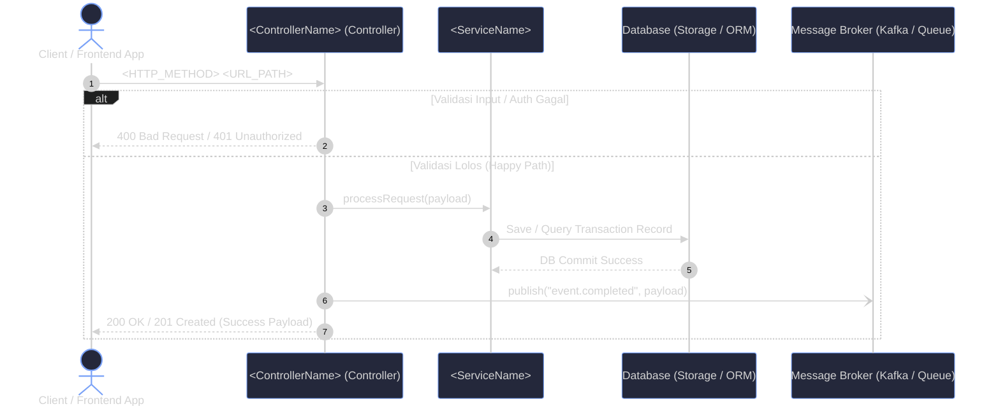
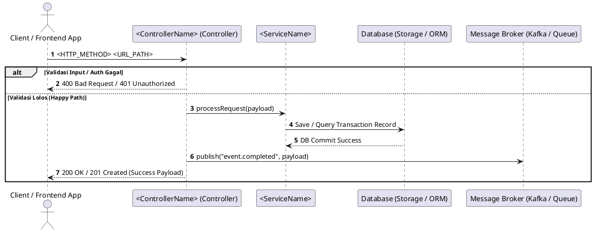

# UML-Architect Skill Instructions

Instruksi ini mengatur AI Agent agar menghasilkan output analisis arsitektur dan diagram UML yang **100% identik dan konsisten** dengan output mesin deterministik UML-Architect MCP Server.

---

## 1. Protokol Eksekusi 5-Tahap (Execution Pipeline)

### Tahap 1: Resolusi Target & Deteksi Basis Kode
1. **Identifikasi Target**:
   - Apakah input berupa **Endpoint API** (misal: `POST /api/v1/orders/checkout`), **Nama Fungsi** (misal: `processPayment`), atau **File/Modul Path** (misal: `src/controllers/order.controller.ts`)?
2. **Pemindaian Manifest (Tanpa Kompilasi)**:
   - Periksa file manifest di proyek: `package.json`, `go.mod`, `pom.xml`, `pyproject.toml`, `Cargo.toml`, `composer.json`, `Gemfile`, atau `*.csproj`.
   - Kenali framework yang digunakan: Express/NestJS, FastAPI/Django, Gin/Fiber, Spring Boot, Axum/Actix, ASP.NET, Laravel, atau Rails.

### Tahap 2: Penelusuran Call-Graph Nyata (Strict Tracing - Zero Hallucination)
Telusuri alur eksekusi dari kode sumber riil:
1. **Pintu Masuk (Entrypoint)**: Buka file rute/controller terkait.
2. **Middleware & Guards**: Lacak pemeriksaan token JWT, session, validasi schema request (Zod, Joi, Pydantic, DTO validator).
3. **Controller / Handler**: Periksa logika ekstraksi parameter request dan delegasi ke layer layanan (*service layer*).
4. **Service / Domain Layer**: Lacak alur bisnis inti, pemanggilan helper, dan kalkulasi data.
5. **Database & ORM**: Lacak operasi query/mutasi (`SELECT`, `INSERT`, `UPDATE`, transaksi commit/rollback).
6. **Integrasi Eksternal**: Lacak HTTP callout (Stripe, Bank API, SendGrid, OAuth) atau RPC call.
7. **Message Queue / Event**: Lacak publikasi event asinkron ke Kafka, RabbitMQ, SQS, Redis PubSub, atau Celery.
8. **Cabang Error**: Petakan blok `try/catch`, `if err != nil`, `except`, atau error guard ke cabang alternatif (`alt`).

---

## 2. Standar Partisipan & Alias Diagram

Gunakan skema penamaan partisipan standar agar diagram bersih, konsisten, dan mudah dibaca:

| Kategori | ID Partisipan | Format Label Partisipan | Tipe Partisipan |
| :--- | :--- | :--- | :--- |
| **Klien / Pemanggil** | `Client` | `Client / Frontend App` (atau `User / Mobile App`) | `actor` |
| **Controller / Handler** | `Ctrl` | `<NamaFile/Controller> (Controller)` | `participant` |
| **Service Layer** | `Svc` | `<NamaService>` (contoh: `OrderService`) | `participant` |
| **Pihak Ketiga / Eksternal**| `ExtAPI` | `<NamaVendor/Gateway> (External API)` (contoh: `Stripe API`) | `participant` |
| **Database / Storage** | `DB` | `Database (Storage / ORM)` (contoh: `PostgreSQL Database`) | `participant` |
| **Antrean / Event Broker** | `Queue` | `Message Broker (Kafka / Queue)` | `participant` |

---

## 3. Aturan Sintaks & Tema Visual Mermaid.js

1. **Theme Directive (Wajib di Baris Pertama Diagram)**:
   Gunakan tema modern `tokyo-night` secara default:
   ```mermaid
   %%{init: {'theme': 'dark', 'themeVariables': { 'primaryColor': '#7aa2f7', 'primaryBorderColor': '#3d59a1', 'actorBkg': '#24283b', 'actorBorder': '#7aa2f7', 'lineColor': '#bb9af7', 'altBkg': '#1f2335' }}}%%
   ```
2. **Sequence Diagram**:
   - Selalu sertakan `sequenceDiagram` dan `autonumber`.
   - Gunakan panah `->>` untuk sinkron, `-->>` untuk return/respons, dan `-)` untuk asinkron/queue event.
   - Bungkus percabangan validasi gagal vs sukses di dalam blok `alt` dan `else`:
     ```mermaid
     alt Validasi Input / Auth Gagal
         Ctrl-->>Client: 400 Bad Request / 401 Unauthorized
     else Validasi Lolos (Happy Path)
         Ctrl->>Svc: processRequest(payload)
         ...
     end
     ```
3. **Self-Healing Sintaks (Anti-Error)**:
   - Hindari karakter kurung siku tanpa kutip di dalam pesan.
   - Jangan gunakan karakter slash (`/`) langsung pada ID partisipan (selalu gunakan alias bersih seperti `Ctrl`, `Svc`).

---

## 4. Format Kontrak Output Wajib (Canonical Output Contract)

Setiap respon pembuatan diagram **WAJIB** mengikuti struktur Markdown persis seperti template di bawah ini agar identik dengan output MCP Server:

````markdown
# UML Diagram: <Target / Endpoint Name>

> *Dihasilkan secara otomatis oleh **UML-Architect Skill Agent** (v1.0.0)*

## Diagram Visual


<details>
<summary>Lihat Format Alternatif (PlantUML)</summary>


</details>

### Penjelasan Alur Arsitektur (<Target / Endpoint Name>)

Alur eksekusi ini melibatkan **<N> komponen utama**:

* **Client / Frontend App** (`Client`): Berperan sebagai entitas pengguna/pemanggil.
* **<ControllerName> (Controller)** (`Ctrl`): Berperan sebagai entitas pengendali request dan respons.
* **<ServiceName>** (`Svc`): Berperan sebagai penyedia logika bisnis domain.
* **Database (Storage / ORM)** (`DB`): Berperan sebagai media persistensi data transaksi.
* **Message Broker (Kafka / Queue)** (`Queue`): Berperan sebagai penerima event asinkron.

#### Rincian Langkah Eksekusi:
1. **Client** mengirimkan request `<HTTP_METHOD> <URL_PATH>` ke **Ctrl**.
   * *Pengecekan Kondisi*: Jika parameter tidak valid atau otentikasi gagal, alur langsung diputus dengan respons HTTP 400/401.
2. **Ctrl** mendelegasikan payload yang valid ke **Svc**.
3. **Svc** menjalankan kueri/mutasi ke **DB** dan menerima konfirmasi penyimpanan.
4. **Ctrl** memancarkan event notifikasi ke **Queue**.
5. **Ctrl** mengembalikan respons sukses HTTP 200/201 ke **Client**.

#### Penanganan Error & Pengecualian (Error Pathways):
* **ValidationException**: Menghasilkan respons HTTP `400` jika payload tidak memenuhi syarat schema.
* **UnauthorizedException**: Menghasilkan respons HTTP `401` jika token otorisasi tidak valid atau kadaluwarsa.
* **InternalException**: Menghasilkan respons HTTP `500` bila terjadi kegagalan jaringan atau database rollback.
````

---

## 5. Ragam Tipe Diagram Lainnya (Jika Diminta Pengguna)

* **Flowchart / Activity Diagram**: Gunakan `flowchart TD` dengan node start/end bulat `([ ... ])`, decision diamond `{ "Kondisi?" }`, dan box proses `[ ... ]`.
* **State Machine Diagram**: Gunakan `stateDiagram-v2` dengan state awal `[*]`, state transisi, guard, dan state terminal `[*]`.
* **Component / Architecture Diagram**: Gunakan `graph TD` dengan `subgraph` berlapis (Presentation Layer, Business Logic Layer, Data & Persistence Layer).
