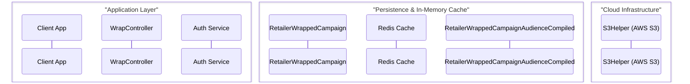
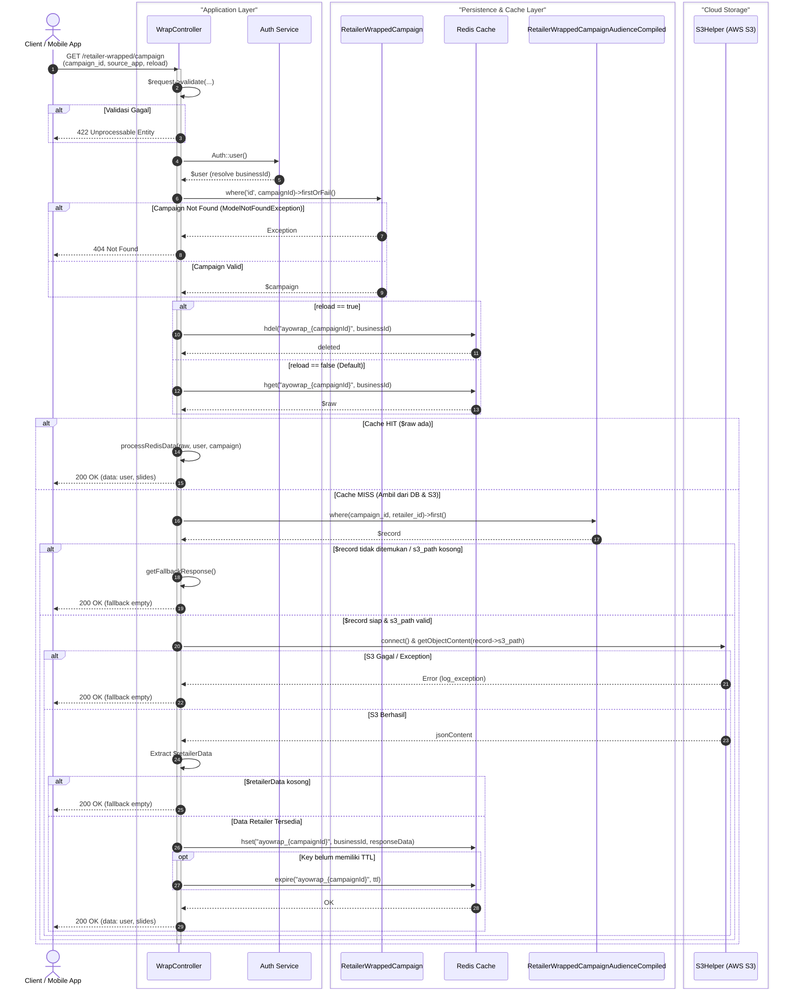

# UML-Architect Engine: Tuning & Enhancement Proposal

> **Dokumen Evaluasi & Rekomendasi Peningkatan Engine `uml-architect`**  
> **Studi Kasus**: Real-World Laravel Controller ([`WrapController::index()`](file:///c:/Weekend/SRC/DTE/ayo-taskmanagement-v2/app/Http/Controllers/Api/V1/General/WrapController.php#L39-L77))  
> **Target Repositori**: `c:\MyProject\skill-agent\uml-architect`  
> **Tanggal**: 2026-09-04  
> **Status**: *RFC (Request for Comments) / Ready for Implementation*

---

## 1. Executive Summary

Evaluasi dilakukan dengan menguji kemampuan pembuatan **Sequence Diagram** pada kode backend enterprise nyata di repositori `ayo-taskmanagement-v2`, khususnya fungsi [`WrapController::index()`](file:///c:/Weekend/SRC/DTE/ayo-taskmanagement-v2/app/Http/Controllers/Api/V1/General/WrapController.php#L39-L77). 

Fungsi ini mencerminkan karakteristik tipikal arsitektur backend modern:
- Penggunaan **multi-tier infrastructure** (Relational DB, In-memory Cache Redis, dan AWS S3 Object Storage).
- Pola **Cache-Aside** dengan invalidasi dinamis (`$reload`).
- Pemecahan alur ke dalam **private helper methods** internal kelas.
- Strategi **graceful fallback** jika data tidak ditemukan atau storage gagal.

Hasil evaluasi menunjukkan bahwa jika tracer hanya melakukan *shallow parsing* pada satu method target, sebagian besar interaksi penting (terutama AWS S3 dan penyimpanan Redis) akan **hilang**. Dokumen ini merangkum gap teknis dan memberikan rekomendasi tuning konkret untuk komponen `core/tracer.js`, `core/synthesizer.js`, dan `profiles/php.profile.json`.

---

## 2. Karakteristik Kode Riil vs Tantangan Tracer

```
HTTP Request (Client)
   │
   ▼
WrapController::index()
   ├── Request Validation ($request->validate)
   ├── Identity Resolution (Auth::user() -> businessId)
   ├── Campaign Verification (RetailerWrappedCampaign::where()->firstOrFail())
   │      └── [Exception Catch: 404 Not Found]
   ├── Redis Cache Check (Redis::hget / Redis::hdel)
   │      ├── [Cache HIT] ──► $this->processRedisData() ──► Return 200 OK
   │      └── [Cache MISS]
   │             │
   │             ▼
   │      $this->fetchAndProcessS3Data()
   │             ├── DB Query (RetailerWrappedCampaignAudienceCompiled)
   │             ├── $this->getS3Data() ──► S3Helper::getObjectContent() [AWS S3]
   │             ├── $this->getUserMetadata()
   │             ├── $this->saveToRedis() ──► Redis::hset() + Redis::expire()
   │             └── Return 200 OK (atau $this->getFallbackResponse())
```

### Tantangan Bagi Tool Otomatis:
1. **Shallow vs Deep Method Call**: Logika krusial (S3, audience compiled DB, Redis caching) tidak berada langsung di dalam body `index()`, melainkan didelegasikan ke `$this->fetchAndProcessS3Data()`, `$this->getS3Data()`, dan `$this->saveToRedis()`.
2. **Stereotipe Partisipan yang Terlalu Umum**: Banyak static tracer melabeli semua I/O sebagai "Database", padahal Redis dan AWS S3 memiliki peran arsitektural yang sangat berbeda.
3. **Pola Percabangan (Branching)**: Pola *Cache Hit vs Cache Miss* bukan sekadar `if-else` biasa, melainkan pola arsitektural *Cache-Aside* yang seharusnya direpresentasikan dengan blok `alt` yang jelas.

---

## 3. Poin-Poin Kesenjangan & Rekomendasi Tuning

### 🔧 Tuning 1: Recursive Intra-Class Method Crawling (`core/tracer.js`)
* **Isu**: Tracer saat ini hanya menganalisis cakupan AST/baris dari fungsi yang ditargetkan (`function_name`). Jika fungsi tersebut memanggil `$this->localMethod()`, pemanggilan infrastruktur di dalam `localMethod()` terabaikan.
* **Rekomendasi**:
  1. Pada saat men-trace method target, kumpulkan semua pemanggilan internal (`$this->methodName()`, `self::methodName()`, atau method private dalam file yang sama).
  2. Implementasikan *recursive visitor* dengan kedalaman traversal yang dapat dikonfigurasi (maksimal kedalaman 2–3 level).
  3. Inline hasil trace node ke alur eksekusi sekuensial method utama.

```javascript
// Konsep implementasi di core/tracer.js
async function traceMethodWithLocalExpansion(filePath, methodName, depth = 0, maxDepth = 2) {
  if (depth > maxDepth) return [];
  const methodAST = extractMethodAST(filePath, methodName);
  const steps = [];

  for (const statement of methodAST.body) {
    const localCall = detectLocalCall(statement); // e.g., $this->fetchAndProcessS3Data()
    if (localCall) {
      // Rekursif baca private method dalam file yang sama
      const subSteps = await traceMethodWithLocalExpansion(filePath, localCall.methodName, depth + 1, maxDepth);
      steps.push(...subSteps);
    } else {
      steps.push(parseStatement(statement));
    }
  }
  return steps;
}
```

---

### 🔧 Tuning 2: Penajaman Stereotipe Infrastruktur (`profiles/php.profile.json`)
* **Isu**: Profil PHP saat ini fokus pada route dan query Eloquent umum. Komponen cache (`Redis::`, `Cache::`) dan storage (`Storage::`, `S3Helper`) perlu dideteksi sebagai partisipan khusus.
* **Rekomendasi**:
  Tambahkan pemetaan khusus infrastruktur pada `profiles/php.profile.json`:

```json
{
  "infrastructure_recognition": {
    "cache": {
      "patterns": [
        "Redis::(hget|hset|hdel|get|set|expire|ttl)",
        "Cache::(get|put|remember|forget|tags)"
      ],
      "participant": {
        "id": "Redis",
        "alias": "Redis Cache",
        "type": "database",
        "color_box": "Data & Cache Layer"
      }
    },
    "cloud_storage": {
      "patterns": [
        "S3Helper",
        "Storage::disk\\(['\"]s3['\"]\\)",
        "Aws\\\\S3\\\\S3Client",
        "getObjectContent",
        "get_image_presign_url"
      ],
      "participant": {
        "id": "S3",
        "alias": "S3Helper (AWS S3)",
        "type": "cloud",
        "color_box": "Cloud Storage"
      }
    },
    "authentication": {
      "patterns": [
        "Auth::user\\(",
        "auth\\(\\)->user\\(",
        "request->user\\("
      ],
      "participant": {
        "id": "Auth",
        "alias": "Auth Service",
        "type": "service",
        "color_box": "Application Layer"
      }
    }
  }
}
```

---

### 🔧 Tuning 3: Heuristic Cache-Aside & Resilience Pattern Recognizer (`core/tracer.js`)
* **Isu**: Percabangan cache hit vs cache miss dan fallback data seringkali menghasilkan representasi yang membingungkan jika dianggap percabangan biasa.
* **Rekomendasi**:
  Buat detektor pola arsitektur:
  1. **Pola Cache-Aside**:
     - *Check*: Adanya pembacaan cache (`hget` / `get`) diikuti dengan `if (!empty($raw))` atau `if ($data) return ...`.
     - *Synthesizer Action*: Otomatis bungkus ke dalam blok:
       - `alt Cache HIT ($raw ada)` $\rightarrow$ return data dari cache.
       - `else Cache MISS ($raw kosong)` $\rightarrow$ fetch DB/S3 $\rightarrow$ simpan ke cache $\rightarrow$ return data.
  2. **Pola Invalidation**:
     - *Check*: Parameter kondisi seperti `$reload` atau `$force` diikuti `hdel` atau `forget`.
     - *Synthesizer Action*: Tambahkan `alt reload == true` untuk aksi hapus cache.
  3. **Pola Graceful Fallback**:
     - *Check*: Return struktur default (e.g. `['user' => [], 'slides' => []]`) saat terjadi missing data atau S3 exception.
     - *Synthesizer Action*: Berikan label alternatif `else Fallback Data Kosong / S3 Error`.

---

### 🔧 Tuning 4: Pengelompokan Visual Menggunakan Mermaid `box` (`core/synthesizer.js`)
* **Isu**: Diagram sekuensial dengan banyak partisipan (Client, Controller, Auth, Models, Redis, S3) tampak membingungkan dan sulit memisahkan batasan jaringan/arsitektur (*boundary*).
* **Rekomendasi**:
  Gunakan fitur Mermaid `box` untuk mengelompokkan partisipan secara otomatis:



---

### 🔧 Tuning 5: Dukungan Granularitas Bertingkat (`detail_level`: L1, L2, L3)
* **Isu**: Dokumen PRD untuk eksekutif/product manager membutuhkan diagram yang simpel, sedangkan dokumen engineering butuh diagram mendalam.
* **Rekomendasi**:
  Sesuaikan synthesizer berdasarkan parameter `detail_level`:
  - **L1 (Executive / Conceptual)**:
    - Hanya 3-4 partisipan: `Client -> Controller -> Cache (Hit) / S3 Storage (Miss) -> Client`.
    - Tanpa rincian validasi request, exception handling, atau kalkulasi TTL.
  - **L2 (Service / Architecture - Default)**:
    - Alur lengkap komponen: Validasi, Auth, Campaign DB, Redis Hash, Compiled Audience DB, S3 Storage, Fallback response.
  - **L3 (Deep Technical / Debugging)**:
    - Menambahkan `Note over` untuk:
      - Format key: `ayowrap_{campaignId}` & field: `(string) businessId`.
      - Kalkulasi TTL: `diffInSeconds(campaign->end_date)`.
      - Skema error code (422, 404, 200).

---

### 🔧 Tuning 6: Auto-Mapper Exception Handling (`try-catch` & ORM Failure)
* **Isu**: Method Laravel seperti `firstOrFail()` memicu `ModelNotFoundException` yang ditangkap untuk menghasilkan respon HTTP 404.
* **Rekomendasi**:
  Jika tracer mendeteksi `firstOrFail()` atau `findOrFail()` di dalam blok `try`:
  - Cabangkan alur menjadi:
    ```mermaid
    alt Entity Ditemukan
      Model-->>Controller: $modelInstance
    else ModelNotFoundException (Catch)
      Controller-->>Client: 404 Not Found
    end
    ```

---

## 4. Contoh Output Ideal yang Dihasilkan Setelah Tuning

Berikut adalah contoh diagram yang dihasilkan jika `uml-architect` telah dituning dengan rekomendasi di atas:



---

## 5. Checklist Implementasi di Repositori `uml-architect`

| No | Target File | Tugas / Penyesuaian | Estimasi Dampak |
|---|---|---|---|
| 1 | `profiles/php.profile.json` | Tambahkan pola `Redis::`, `Cache::`, `S3Helper`, dan `Storage::disk` pada rule pattern. | **Tinggi** (Identifikasi komponen akurat) |
| 2 | `core/tracer.js` | Implementasikan fungsi *local private method crawler* (`traceMethodWithLocalExpansion`). | **Kritis** (Mencegah alur S3 dan DB kedua terpotong) |
| 3 | `core/tracer.js` | Tambahkan deteksi otomatis struktur *Cache-Aside* (`hget/get` -> check empty -> `hset/put`). | **Tinggi** (Percabangan diagram lebih cerdas) |
| 4 | `core/synthesizer.js` | Tambahkan sintaks `box "Layer Name"` pada generator Mermaid sequence diagram. | **Tinggi** (Kerapian dan visual presentation) |
| 5 | `core/synthesizer.js` | Implementasikan filter node berdasarkan parameter `detail_level` (`L1`, `L2`, `L3`). | **Sedang** (Fleksibilitas kebutuhan user) |
| 6 | `tests/test_all.js` | Buat fixture baru `tests/fixtures/sample_laravel_cache_s3.php` untuk regression test. | **Tinggi** (Menjaga stabilitas engine) |
