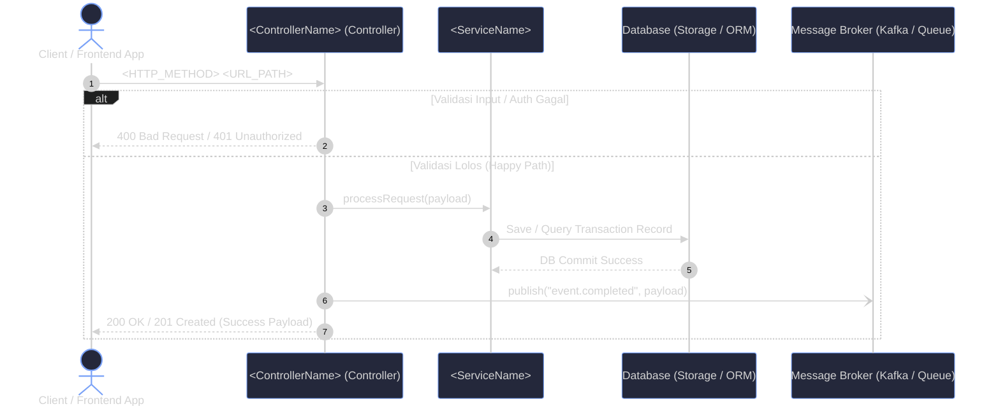
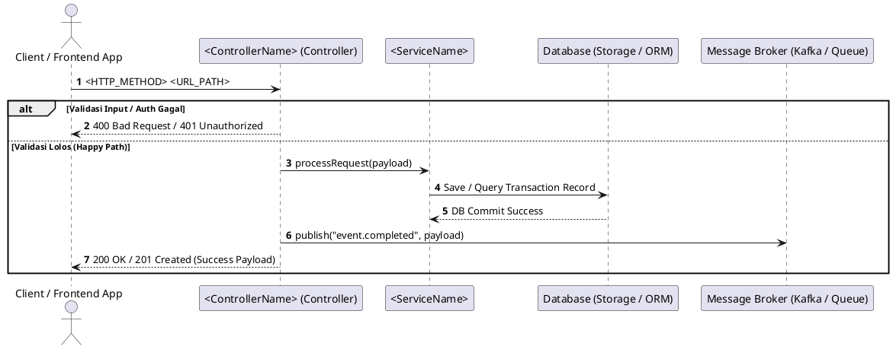

# Kiro Steering: UML-Architect

When user asks to generate UML diagrams, sequence flows, or architecture documentation from code:

## 1. Discovery & Multi-Language Ingestion
- Automatically detect the target: API endpoint (`POST /api/...`), function/method name, or file path.
- Inspect project manifests (`package.json`, `go.mod`, `pom.xml`, `pyproject.toml`, `Cargo.toml`, etc.) to dynamically apply framework-specific routing and middleware rules.

## 2. Strict Call-Graph Tracing (Zero-Hallucination)
- **Lifecycle Mapping**: Map execution from route handler -> validation/guards -> controller -> domain services -> persistence/ORM -> external APIs -> message brokers.
- **Error Pathways**: Always identify `try/catch`, `if err != nil`, and error returns. Map them to `alt` / `opt` blocks.
- **Verification**: Only include classes, methods, and actors that actually exist in the source code.

## 3. Standard Participant ID & Alias Scheme
- `Client` (actor): `Client as Client / Frontend App`
- `Ctrl` (participant): `<ControllerName> (Controller)`
- `Svc` (participant): `<ServiceName>`
- `ExtAPI` (participant): `<ExternalGateway> (External API)`
- `DB` (participant): `Database (Storage / ORM)`
- `Queue` (participant): `Message Broker (Kafka / Queue)`

## 4. Exact Canonical Output Contract
Always format responses to match this exact output contract:

````markdown
# UML Diagram: <Target / Endpoint Name>

> *Dihasilkan secara otomatis oleh **UML-Architect Skill Agent** (v1.1.0)*

## Diagram Visual


<details>
<summary>Lihat Format Alternatif (PlantUML)</summary>


</details>

### Penjelasan Alur Arsitektur (<Target / Endpoint Name>)

Alur eksekusi ini melibatkan **<N> komponen utama**:

* **Client / Frontend App** (`Client`): Berperan sebagai entitas pengguna/pemanggil.
* **<ControllerName> (Controller)** (`Ctrl`): Berperan sebagai entitas pengendali request dan respons.
* **<ServiceName>** (`Svc`): Berperan sebagai penyedia logika bisnis domain.
* **Database (Storage / ORM)** (`DB`): Berperan sebagai media persistensi data transaksi.
* **Message Broker (Kafka / Queue)** (`Queue`): Berperan sebagai penerima event asinkron.

#### Rincian Langkah Eksekusi:
1. **Client** mengirimkan request ke **Ctrl**.
2. **Ctrl** memvalidasi request dan mendelegasikan ke **Svc**.
3. **Svc** menjalankan query/mutasi ke **DB**.
4. **Ctrl** mengembalikan respons sukses HTTP 200/201 ke **Client**.

#### Penanganan Error & Pengecualian (Error Pathways):
* **ValidationException**: Menghasilkan respons HTTP `400`.
* **InternalException**: Menghasilkan respons HTTP `500`.
````
