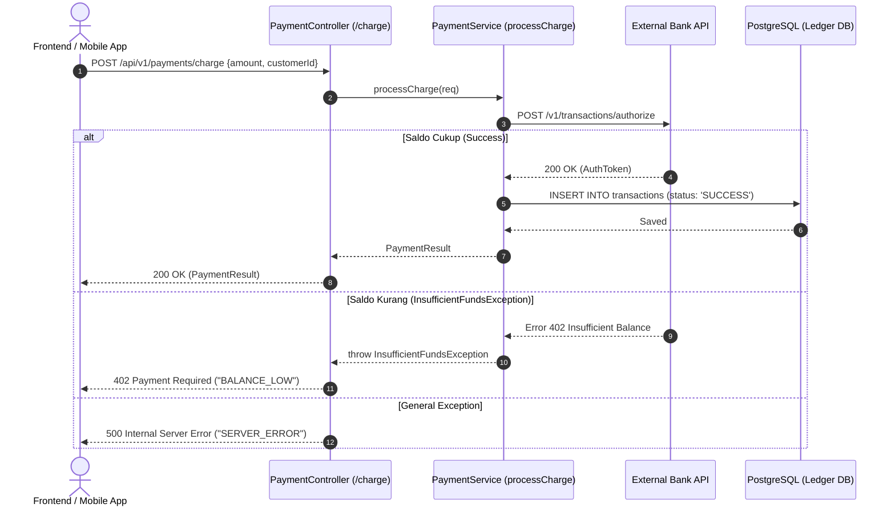
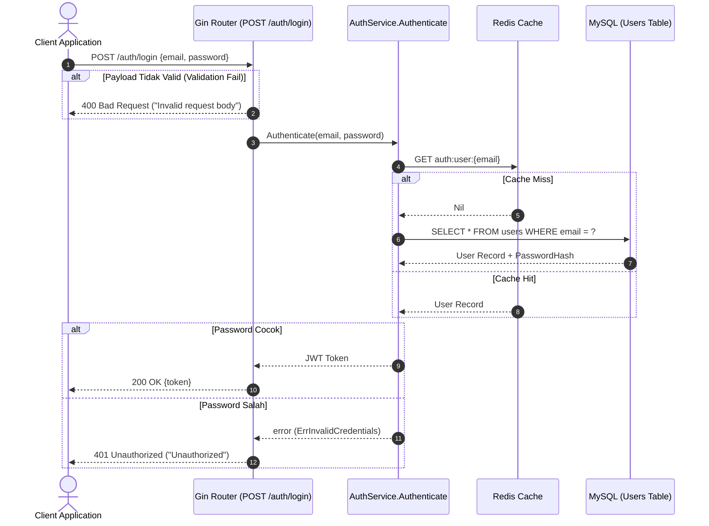
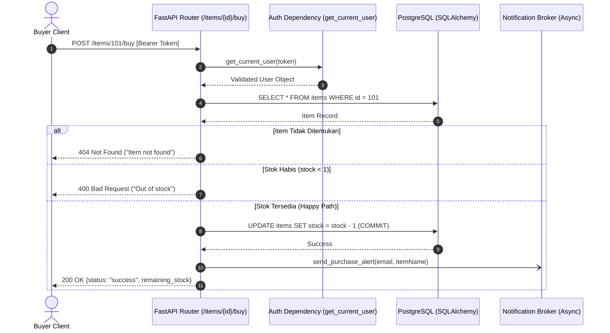
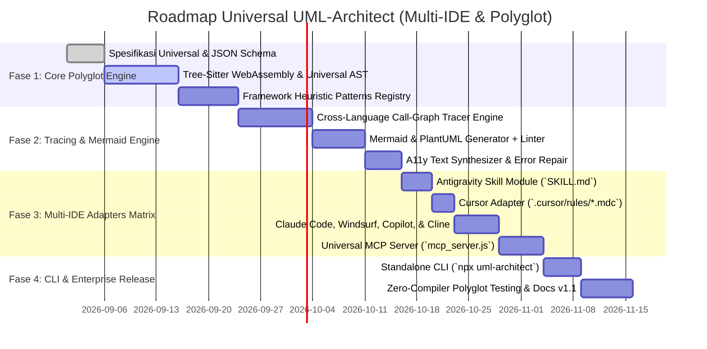

# Product Requirements Document (PRD)
## UML-Architect: Universal Autonomous Code-to-Diagram Skill Agent

* **Product Name**: UML-Architect (Universal Code-to-UML Skill Agent)
* **Version**: 1.0.0-universal
* **Status**: Proposed / In Review
* **Target Platforms**: Universal Agent Ecosystem — Google Antigravity IDE, Cursor, Claude Code, Windsurf, GitHub Copilot / VS Code, Roo Code, Cline, Continue.dev, Aider, dan Standalone MCP Server / CLI.
* **Target Languages**: **100% Polyglot / Language-Agnostic** (TypeScript/JavaScript, Python, Go, Java, Kotlin, C#, Rust, PHP, Ruby, C/C++, Swift, Scala, Elixir, Dart, Zig, Solidity, etc.).
* **Target Audience**: Software Engineers, Solutions Architects, Tech Leads, Technical Writers, QA Engineers across all programming ecosystems.

---

## 1. Executive Summary & Problem Statement

### 1.1 Latar Belakang & Masalah (Problem Statement)
Dokumentasi arsitektur perangkat lunak hampir selalu mengalami masalah "documentation rot" (kadaluwarsa dan tidak sinkron dengan implementasi kode riil). Pengembang membutuhkan diagram UML (khususnya *Sequence Diagram*, *Flowchart/Activity*, *Class/ERD*, dan *State Machine*) untuk onboarding, audit keamanan, PR review, dan kolaborasi antar-tim.

Namun, solusi yang ada saat ini menghadapi hambatan besar:
1. **Keterbatasan Ekosistem IDE (Vendor Lock-in)**: Solusi diagramming umumnya terikat pada satu platform tertentu (hanya extension VS Code biasa atau plugin spesifik), tidak dapat bekerja serentak di berbagai AI Agent IDE modern seperti Antigravity, Cursor, Claude Code, Windsurf, maupun Cline.
2. **Keterbatasan Bahasa Pemrograman (Language Silos)**: Sebagian besar generator diagram berbasis kode hanya mendukung 1 atau 2 bahasa (misal: hanya Java atau hanya TypeScript) dan gagal memproses proyek polyglot, microservices heterogen, atau bahasa modern seperti Rust, Go, Elixir, dan Kotlin.
3. **Ketergantungan Compiler Lokal (Heavy Toolchain Requirement)**: Alat konvensional mengharuskan compiler/runtime terpasang lengkap di mesin (misal: harus ada `javac`, `mvn`, `cargo`, atau `dotnet SDK`), membuat analisis kode yang belum ter-build menjadi mustahil.
4. **Alur Parsial & Rentan Halusinasi**: AI umum (*general-purpose LLMs*) sering mengarang nama fungsi atau mengabaikan alur kritis seperti rantai middleware, penanganan exception (`try-catch`, `if err != nil`), transaksi database, atau event antrean (*message queues*).

### 1.2 Solusi: UML-Architect Universal Skill Agent
**UML-Architect** adalah *autonomous specialized skill agent* yang dirancang dengan arsitektur **Tri-Layer Polyglot Engine** dan **Cross-Agent Adapter Matrix**:
* **Universal IDE Compatibility**: Beroperasi secara native di semua AI Agent IDE modern melalui standar terbuka **Model Context Protocol (MCP)**, adapter aturan (`SKILL.md`, `.cursor/rules`, `.windsurfrules`, `CLAUDE.md`, `.clinerules`), serta CLI mandiri.
* **Universal Polyglot Ingestion**: Mampu membaca, menelusuri, dan memahami kode dalam **bahasa pemrograman apa pun** tanpa mewajibkan kompilasi kode lokal, menggunakan kombinasi *Tree-sitter universal AST*, *heuristic structural patterns*, dan *semantic LLM call-graph traversal*.
* **Deterministik & Anti-Halusinasi**: Hanya dengan input berupa **endpoint API**, **nama fungsi**, atau **path file/direktori**, agent melacak *call-graph* riil dari pintu masuk (entrypoint), middleware, controller, service layer, database/ORM, hingga third-party API dan async queue.

---

## 2. Product Goals & Core Objectives

| Metrik / Goal | Target | Indikator Keberhasilan |
| :--- | :--- | :--- |
| **Universal IDE Coverage** | $\mathbf{100\%}$ | Dapat dijalankan di Antigravity, Cursor, Claude Code, Windsurf, Copilot, Roo Code, Cline, Continue.dev, & MCP clients. |
| **Universal Language Support** | $\mathbf{100\%}$ Polyglot | Mampu membaca bahasa apa pun (TS/JS, Python, Go, Java, C#, Rust, PHP, Ruby, C/C++, Kotlin, Elixir, dll.) tanpa compiler lokal. |
| **Akurasi Alur Eksekusi (Anti-Hallucination)** | $\ge \mathbf{98\%}$ | Semua participant/actor, method, dan service call terbukti ada di basis kode riil. |
| **Sintaks Validitas Diagram** | $\mathbf{100\%}$ | Diagram bebas error rendering di Mermaid.js (GitHub Flavored Markdown) dan PlantUML. |
| **Latency Waktu Analisis** | $< \mathbf{15}$ detik | Waktu dari perintah hingga diagram Markdown siap saji. |
| **Edge Case & Error Handling Visibility** | Otomatis | Menampilkan percabangan validasi gagal, database rollback, dan exception handling dalam blok `alt / opt`. |

---

## 3. Universal Architecture & Core Engine Design

UML-Architect mengadopsi pola **Hybrid Hub-and-Spoke Architecture**:
* **Front-Facing (Sisi Pengguna)**: Menampilkan **1 Unified Skill Interface** (`@uml-architect` di semua IDE). Pengguna tidak perlu repot berganti-ganti skill saat berpindah bahasa atau repositori.
* **Back-Facing (Sisi Engine)**: Menggunakan **Modular Language Profiles (`profiles/*.profile.json`)** yang di-load secara dinamis (*on-demand*) berbasis deteksi manifest proyek (`go.mod`, `pom.xml`, `package.json`, dll.).

### 3.1 Mengapa Memilih Arsitektur Hybrid?
1. **Zero Context Bloat (Hemat Token LLM)**: Tidak menyuntikkan instruksi 20+ bahasa sekaligus ke dalam context window. Hanya aturan bahasa yang relevan dengan repo aktif yang dimuat.
2. **Eliminasi Halusinasi Silang**: Mencegah LLM mencari konsep bahasa lain (misal: mencari anotasi Java `@Autowired` di basis kode Go atau dekorator Python di Rust).
3. **Dukungan Monorepo & Microservices Alami**: Jika sebuah monorepo memiliki backend Go dan frontend TypeScript, engine secara cerdas memuat profil Go dan TypeScript secara simultan.
4. **Skalabilitas Mudah**: Menambahkan dukungan framework atau bahasa baru cukup dengan menambahkan satu file profil di direktori `profiles/` tanpa merombak core engine.

### 3.2 High-Level Architecture Diagram

```mermaid
graph TB
    subgraph ClientLayer ["1. Universal Agent IDE Layer (Single Interface)"]
        A1["Google Antigravity<br/>(@uml-architect / SKILL.md)"]
        A2["Cursor<br/>(.cursor/rules/*.mdc)"]
        A3["Claude Code<br/>(CLAUDE.md)"]
        A4["Windsurf<br/>(.windsurfrules)"]
        A5["VS Code / Copilot<br/>(.github/copilot-instructions)"]
        A6["Roo Code / Cline<br/>(.clinerules)"]
        A7["Universal MCP Clients<br/>(Continue.dev, Desktop, etc.)"]
        A8["Terminal CLI<br/>(npx uml-architect)"]
    end

    subgraph CoreEngine ["2. Core Orchestrator & Dynamic Profile Loader"]
        M1["MCP Server Protocol & CLI Dispatcher"]
        M2["Manifest Sniffer & Project Scanner<br/>(Deteksi: go.mod, pom.xml, package.json, dll.)"]
        M3["Dynamic Profile Loader (In-Memory Injector)"]
    end

    subgraph ProfilesRegistry ["3. Modular Language Profiles (On-Demand)"]
        P1["go.profile.json<br/>(Gin, Fiber, Goroutine, err!=nil)"]
        P2["jvm.profile.json<br/>(Spring Boot, JPA, Exceptions)"]
        P3["python.profile.json<br/>(FastAPI, Django, SQLAlchemy)"]
        P4["typescript.profile.json<br/>(NestJS, Express, Prisma)"]
        P5["rust.profile.json<br/>(Axum, Actix, Result/Match)"]
        P6["csharp.profile.json<br/>(ASP.NET Core, EF Core)"]
        P7["generic.profile.json<br/>(Universal AST Fallback)"]
    end

    subgraph PolyglotEngine ["4. Tri-Layer Call-Graph Tracing Engine"]
        L1["Layer 1: Universal Tree-sitter AST (Zero-Compiler)"]
        L2["Layer 2: Framework Heuristic Matcher"]
        L3["Layer 3: Semantic LLM Reasoner (Dynamic / Fallback)"]
    end

    subgraph SynthesisLayer ["5. Synthesis & Validation Engine"]
        S1["Abstraction Filtering (L1 High / L2 Standard / L3 Deep)"]
        S2["Mermaid / PlantUML Generator"]
        S3["Self-Healing Syntax Validator & A11y Narrator"]
    end

    subgraph OutputLayer ["6. Deliverables"]
        O1["Rendered Markdown with Mermaid"]
        O2["Standalone PlantUML (.puml)"]
        O3["Architecture Narrative Walkthrough"]
    end

    ClientLayer --> CoreEngine
    M1 --> M2
    M2 --> M3
    M3 -->|Load on-demand| ProfilesRegistry
    ProfilesRegistry --> PolyglotEngine
    PolyglotEngine --> SynthesisLayer
    SynthesisLayer --> OutputLayer
```



### 3.3 Target Repository Structure Blueprint
```
uml-architect/
├── SKILL.md                          # Antigravity Skill Entrypoint
├── adapters/                         # Multi-IDE Rules Adapters
│   ├── antigravity/SKILL.md
│   ├── cursor/uml-architect.mdc
│   ├── claude/CLAUDE.md
│   ├── windsurf/.windsurfrules
│   ├── copilot/copilot-instructions.md
│   └── cline/.clinerules
├── bin/
│   └── cli.js                        # CLI runner (npx uml-architect)
├── core/
│   ├── index.js                      # Core Orchestrator
│   ├── mcp_server.js                 # Universal MCP Server
│   ├── manifest_sniffer.js           # Dynamic Language & Framework Detector
│   ├── profile_loader.js             # On-Demand Profile Injector
│   ├── tracer.js                     # Call-Graph Tracer Engine
│   ├── synthesizer.js                # Mermaid / PlantUML Synthesizer
│   └── validator.js                  # Self-Healing Syntax Validator
├── profiles/                         # Modular Language Profiles
│   ├── typescript.profile.json
│   ├── python.profile.json
│   ├── go.profile.json
│   ├── jvm.profile.json
│   ├── csharp.profile.json
│   ├── rust.profile.json
│   ├── php.profile.json
│   ├── ruby.profile.json
│   └── generic.profile.json          # Universal AST / Semantic Fallback
├── tests/
└── package.json
```

---

## 4. Modular Language Profiles & Polyglot Engine Specification

### 4.1 Spesifikasi Skema File Profil (`*.profile.json`)
Setiap file di `profiles/` mendefinisikan karakteristik unik bahasa dan framework:

```json
{
  "language": "go",
  "displayName": "Go (Golang)",
  "manifestTriggers": ["go.mod", "Gopkg.lock"],
  "extensions": [".go"],
  "frameworks": {
    "gin": {
      "routePatterns": ["r\\.(GET|POST|PUT|DELETE|PATCH)\\([\"']([^\"']+)[\"']", "(?i)router\\.(GET|POST)"],
      "handlerSignature": "func\\((c|ctx)\\s+\\*gin\\.Context\\)",
      "responsePatterns": ["c\\.JSON\\((\\d+)", "c\\.AbortWithStatus\\((\\d+)"]
    },
    "fiber": {
      "routePatterns": ["app\\.(Get|Post|Put|Delete)\\([\"']([^\"']+)[\"']"],
      "responsePatterns": ["c\\.Status\\((\\d+)\\)\\.JSON"]
    }
  },
  "controlFlow": {
    "errorHandling": ["if\\s+err\\s*!=\\s*nil", "panic\\(", "recover\\("],
    "asyncWorkflow": ["go\\s+[a-zA-Z0-9_.]+\\(", "<-chan", "chan<-"]
  },
  "database": {
    "ormTriggers": ["gorm.io/gorm", "github.com/jmoiron/sqlx"],
    "queryMethods": ["Find", "First", "Create", "Save", "Delete", "Exec", "QueryRow"]
  }
}
```

### 4.2 Tri-Layer Polyglot Execution Strategy
Ketika pengguna meminta diagram dari endpoint, function, atau path, eksekusi dilakukan dalam 3 lapis:

1. **Layer 1: Universal Tree-sitter Static AST (Zero-Compiler)**:
   * Menggunakan runtime Tree-sitter (WebAssembly / native bindings) yang mencakup lebih dari 40 grammar bahasa (C, C++, C#, Rust, Go, Java, Kotlin, Python, Ruby, PHP, Swift, Dart, Elixir, Scala, dll.).
   * **Keunggulan Mutlak**: Tidak memerlukan runtime/compiler bahasa terpasang di komputer pengguna (`cargo`, `go`, `dotnet`, atau `javac` tidak wajib ada).
2. **Layer 2: Framework Heuristic Matcher**:
   * Membaca aturan dari file profil aktif yang dimuat oleh `profile_loader.js`.
   * Memetakan decorator, anotasi route, middleware chaining, operasi database/ORM, dan penanganan error ke node-edge graf alur.
3. **Layer 3: Semantic LLM Call-Graph Reasoner (Fallback & Dynamic Languages)**:
   * Jika bahasa atau framework tidak terdaftar di direktori `profiles/`, engine otomatis menggunakan `generic.profile.json` yang memandu LLM melakukan inferensi semantik terhadap dependensi, import, dan alur eksekusi kode secara cerdas.

---

## 5. Universal Agent IDE Ecosystem Compatibility (Semua Agent IDE)

UML-Architect dirancang agar langsung dapat digunakan di lingkungan AI Agent IDE mana pun tanpa friksi:

### 5.1 Matrix Adapter Antar-IDE

| Platform IDE / Agent | Mekanisme Integrasi | Lokasi File Konfigurasi | Cara Pemanggilan Pengguna |
| :--- | :--- | :--- | :--- |
| **Google Antigravity IDE** | Native Skill Module | `skills/uml-architect/SKILL.md` atau `.agents/skills/uml-architect/` | `@uml-architect` atau prompt konteks |
| **Cursor** | MDC Rules & Prompt Composer | `.cursor/rules/uml-architect.mdc` | `@uml-architect` di Agent Mode / Composer |
| **Claude Code** | Global Project Rules & MCP | `CLAUDE.md` + Claude MCP Config | `/uml-architect` atau prompt instruksi |
| **Windsurf (Codeium)** | Windsurf Cascade Rules | `.windsurfrules` atau `.windsurf/rules/` | Prompt otomatis Cascade agent |
| **VS Code / Copilot** | Copilot Instructions & Chat | `.github/copilot-instructions.md` | `@workspace /uml` atau Copilot Chat |
| **Roo Code / Cline** | Custom System Rules & MCP | `.clinerules` | Prompt Cline dengan MCP tool call |
| **Continue.dev** | Custom MCP Extension | `.continue/config.json` | Slash command atau Chat agent |
| **Semua IDE Lainnya** | **Universal MCP Protocol** | `mcp_server.js` (stdio / SSE) | Native Tool Calling di agent manapun |
| **Terminal / CI-CD** | Standalone CLI Binary | Global `npx uml-architect` | Script bash / workflow pipeline |

### 5.2 One-Command Universal Setup (`npx uml-architect init`)
Pengguna dapat mengaktifkan skill ini di semua IDE sekaligus dengan satu perintah:
```bash
# Menyiapkan konfigurasi otomatis untuk IDE yang terdeteksi di workspace
npx uml-architect init

# Atau mengaktifkan adapter spesifik:
npx uml-architect init --ide antigravity,cursor,claude,windsurf,cline
```
Perintah ini akan secara instan meletakkan file rule/skill yang sesuai di direktori proyek pengembang.

---

## 6. Functional Requirements (Spesifikasi Fitur Lengkap)

### 6.1 Multi-Input Ingestion (FR-1)
* **FR-1.1 Endpoint API Ingestion**: Pengguna memberikan endpoint HTTP/gRPC (contoh: `POST /api/v1/auth/login`, `GET /users/{id}`, `grpc:OrderService.CreateOrder`). Agent mencari route handler terkait di bahasa dan framework apa pun.
* **FR-1.2 Function / Method Signature Ingestion**: Pengguna memberikan nama fungsi atau kelas (contoh: `PaymentProcessor.executeTransaction`, `handle_webhook()`, `ReconcileBalances`).
* **FR-1.3 File / Module Path Ingestion**: Pengguna memberikan path relatif (contoh: `services/order/`, `app/controllers/user_controller.rb`, `pkg/auth/token.go`).
* **FR-1.4 Natural Language Ingestion**: Pengguna memberikan deskripsi alur bahasa alami (contoh: "Gambarkan alur pendaftaran customer sampai terkirim email sambutan").

### 6.2 Deep Call-Graph Tracing Engine (FR-2)
* **FR-2.1 Complete Request Lifecycle**: Melacak secara berurutan:
  $$\text{Entry (Client)} \longrightarrow \text{Middleware / Filter} \longrightarrow \text{Controller / Handler} \longrightarrow \text{Service / Business Logic} \longrightarrow \text{Repository / ORM} \longrightarrow \text{Database / API Eksternal}$$
* **FR-2.2 Asynchronous & Background Workflows**: Melacak dispatch event ke antrean (Queue/PubSub/Worker) dan menggambarkan transisi asinkron (`par` block atau panah terputus `-->`).
* **FR-2.3 Error & Fallback Paths**: Mendeteksi seluruh kemungkinan error (Validation Fail, Unauthorized 401, Not Found 404, Payment Declined, DB Crash) dan menggambarkannya di dalam blok `alt` (Alternate Path).

### 6.3 Ragam Tipe Diagram UML (FR-3)

| Tipe Diagram | Kegunaan | Format Output |
| :--- | :--- | :--- |
| **Sequence Diagram** *(Default & Crown Jewel)* | Alur transaksi API, komunikasi antar-service, request-response | Mermaid `sequenceDiagram` & PlantUML |
| **Activity / Flowchart** | Algoritma keputusan rumit, branching `if-else`, looping | Mermaid `flowchart TD / LR` |
| **Class & ERD Diagram** | Struktur data model, entitas ORM, relasi tabel foreign keys | Mermaid `classDiagram` / `erDiagram` |
| **State Machine Diagram** | Siklus perubahan status entitas (*State transitions*) | Mermaid `stateDiagram-v2` |
| **Component / Architecture** | Boundary modul, dependensi package, Clean/Hexagonal layers | Mermaid `graph` / C4 Component |

### 6.4 Tingkat Abstraksi Fleksibel (FR-4)
* **L1 - High-Level (Executive/Architecture)**: Interaksi makro antar-komponen utama (`Client -> Gateway -> Service -> DB`).
* **L2 - Standard (Developer/PR Review - Default)**: Menampilkan controller, service, repository, database, serta percabangan validasi & error.
* **L3 - Deep Dive (Debug/Detailed Implementation)**: Rincian parameter fungsi internal, helper, logging, in-memory cache, dan return types.

### 6.5 Jaminan Sintaks & Theming Standar Tinggi (FR-5)
* **FR-5.1 Deterministic Syntax Validation & Self-Healing**:
  * Seluruh output Mermaid diuji validitas sintaksnya sebelum disajikan.
  * Jika terdapat karakter berbahaya (tanda kurung kurawal, slash tanpa quote, operator logika `&&`), engine otomatis melakukan quoting/escaping aman (`["/path/name"]`).
* **FR-5.2 Modern Theming**:
  * Pilihan tema warna: `tokyo-night`, `catppuccin`, `nord`, `github-dark`, dan `minimalist`.
  * Visual highlight: Hijau (Sukses), Merah (Gagal/Error), Biru (Database), Kuning/Ungu (External API/Queue).
* **FR-5.3 A11y & WCAG 2.2 AA Compliance**:
  * Setiap diagram wajib disertai deskripsi teks naratif terstruktur di bawahnya untuk pembaca layar (*screen reader*).

### 6.6 Standar Pengiriman Output / Artifact (FR-6)
* Disajikan dalam blok Markdown ` ```mermaid ` standar yang langsung me-render visual di semua viewer.
* Opsi ekspor ke file fisik: `docs/diagrams/{slug}.md` atau `.puml`.
* Dilengkapi tabel parameter request, response payload, dan daftar error code yang dipetakan langsung dari kode sumber.

---

## 7. Model Context Protocol (MCP) Server Specification

Sebagai jembatan universal ke semua Agent IDE, MCP Server menyediakan toolset native:

```json
{
  "tools": [
    {
      "name": "trace_endpoint_flow",
      "description": "Traces full execution flow of an API endpoint across any language/framework and returns structured call-graph nodes.",
      "parameters": {
        "type": "object",
        "properties": {
          "endpoint": { "type": "string", "description": "e.g. POST /api/v1/orders" },
          "httpMethod": { "type": "string", "enum": ["GET", "POST", "PUT", "PATCH", "DELETE", "OPTIONS"] },
          "detailLevel": { "type": "string", "enum": ["L1", "L2", "L3"], "default": "L2" }
        },
        "required": ["endpoint"]
      }
    },
    {
      "name": "trace_function_flow",
      "description": "Traces call hierarchy and logic branches of a function or method in any programming language.",
      "parameters": {
        "type": "object",
        "properties": {
          "functionName": { "type": "string" },
          "filePath": { "type": "string" },
          "detailLevel": { "type": "string", "enum": ["L1", "L2", "L3"], "default": "L2" }
        },
        "required": ["functionName"]
      }
    },
    {
      "name": "generate_uml_diagram",
      "description": "Generates 100% valid Mermaid or PlantUML diagram from analyzed code trace.",
      "parameters": {
        "type": "object",
        "properties": {
          "target": { "type": "string", "description": "Endpoint, function name, or file path" },
          "diagramType": { "type": "string", "enum": ["sequence", "flowchart", "class", "state", "component"], "default": "sequence" },
          "theme": { "type": "string", "enum": ["tokyo-night", "catppuccin", "nord", "default"], "default": "tokyo-night" }
        },
        "required": ["target"]
      }
    },
    {
      "name": "validate_mermaid_syntax",
      "description": "Validates and auto-repairs Mermaid syntax string to guarantee 0% render failure.",
      "parameters": {
        "type": "object",
        "properties": {
          "mermaidCode": { "type": "string" }
        },
        "required": ["mermaidCode"]
      }
    }
  ]
}
```

---

## 8. Polyglot Examples: Ragam Bahasa Pemrograman & Hasil Diagram

### 8.1 Contoh 1: Java (Spring Boot)
#### Input Kode:
```java
@RestController
@RequestMapping("/api/v1/payments")
public class PaymentController {
    @Autowired private PaymentService paymentService;

    @PostMapping("/charge")
    public ResponseEntity<?> chargeCustomer(@Valid @RequestBody ChargeRequest req) {
        try {
            PaymentResult res = paymentService.processCharge(req);
            return ResponseEntity.ok(res);
        } catch (InsufficientFundsException e) {
            return ResponseEntity.status(402).body(new ErrorDto("BALANCE_LOW"));
        } catch (Exception e) {
            return ResponseEntity.status(500).body(new ErrorDto("SERVER_ERROR"));
        }
    }
}
```

#### Output Diagram yang Dihasilkan:


---

### 8.2 Contoh 2: Go (Gin Framework)
#### Input Kode:
```go
func RegisterAuthRoutes(r *gin.Engine, svc AuthService) {
    r.POST("/auth/login", func(c *gin.Context) {
        var req LoginRequest
        if err := c.ShouldBindJSON(&req); err != nil {
            c.JSON(400, gin.H{"error": "Invalid request body"})
            return
        }
        token, err := svc.Authenticate(req.Email, req.Password)
        if err != nil {
            c.JSON(401, gin.H{"error": "Unauthorized"})
            return
        }
        c.JSON(200, gin.H{"token": token})
    })
}
```

#### Output Diagram yang Dihasilkan:


---

### 8.3 Contoh 3: Python (FastAPI & SQLAlchemy)
#### Input Kode:
```python
@router.post("/items/{item_id}/buy")
async def purchase_item(item_id: int, user: User = Depends(get_current_user), db: Session = Depends(get_db)):
    item = db.query(Item).filter(Item.id == item_id).first()
    if not item:
        raise HTTPException(status_code=404, detail="Item not found")
    if item.stock < 1:
        raise HTTPException(status_code=400, detail="Out of stock")
        
    item.stock -= 1
    db.commit()
    await notification_broker.send_purchase_alert(user.email, item.name)
    return {"status": "success", "remaining_stock": item.stock}
```

#### Output Diagram yang Dihasilkan:


---

## 9. Configuration File Specification (`uml-architect.config.json`)

Pengembang dapat menyesuaikan pengaturan sistem secara terpusat:

```json
{
  "$schema": "https://raw.githubusercontent.com/uml-architect/schema/v1/config.json",
  "defaultDiagramType": "sequence",
  "detailLevel": "standard",
  "theme": "tokyo-night",
  "polyglot": {
    "preferTreeSitter": true,
    "scanSubmodules": true,
    "frameworkHints": {
      "python": "fastapi",
      "java": "spring-boot",
      "go": "gin",
      "csharp": "aspnet-core",
      "rust": "axum",
      "php": "laravel",
      "ruby": "rails"
    }
  },
  "adapters": {
    "antigravity": true,
    "cursor": true,
    "claudeCode": true,
    "windsurf": true,
    "copilot": true,
    "cline": true
  },
  "output": {
    "directory": "docs/diagrams",
    "format": ["mermaid", "markdown", "puml"],
    "includeNarrativeWalkthrough": true,
    "includeParticipantsTable": true
  },
  "ignorePatterns": [
    "**/node_modules/**",
    "**/vendor/**",
    "**/target/**",
    "**/dist/**",
    "**/.git/**",
    "**/*_test.*",
    "**/*.spec.*"
  ],
  "styling": {
    "showErrorBranches": true,
    "showDatabaseTransactions": true,
    "showAsyncQueues": true,
    "accentColor": "#7aa2f7"
  }
}
```

---

## 10. Project Implementation Roadmap



---

## 11. Acceptance Criteria (Kriteria Keberhasilan Rilis)

1. [ ] **Universal IDE Support**: Berfungsi lancar di Antigravity, Cursor, Claude Code, Windsurf, Copilot, Cline, dan klien MCP tanpa konfigurasi berbelit.
2. [ ] **Polyglot Independence**: Mampu menganalisis file minimal dalam 8 bahasa berbeda (TypeScript, Python, Go, Java, C#, Rust, PHP, Ruby) tanpa mengharuskan runtime/compiler bahasa tersebut terpasang di OS lokal.
3. [ ] **Zero-Error Mermaid Output**: 100% diagram yang dihasilkan valid secara sintaks dan langsung dapat dirender di GitHub Flavored Markdown (GFM) dan viewer IDE.
4. [ ] **Full Lifecycle Coverage**: Diagram endpoint wajib menampilkan alur middleware, controller, service, DB/ORM, integrasi eksternal, dan percabangan error (`alt` block).
5. [ ] **Auto Adapter Generator**: Perintah `npx uml-architect init` dapat secara otomatis mendeteksi dan mengonfigurasi adapter untuk IDE yang aktif di proyek.
