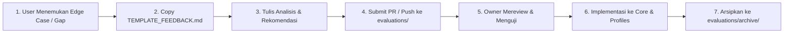

# 📋 Evaluation & Feedback Hub — UML-Architect

Selamat datang di **Evaluation & Feedback Hub** `uml-architect`. Direktori ini dirancang khusus sebagai jembatan kolaborasi antara pengguna (*users/engineers*) dan pemelihara repositori (*maintainers*).

Ketika Anda menggunakan skill atau MCP `uml-architect` pada basis kode nyata (*real-world codebase*) dan menemukan kasus di mana diagram kurang akurat, alur terpotong, atau ada pola arsitektur baru yang belum dikenali, Anda dapat mendokumentasikannya di sini.

---

## 🔄 Alur Kerja Evaluasi (Workflow)



### 1. Untuk Pengguna / Kontributor:
1. Salin template [`TEMPLATE_FEEDBACK.md`](./TEMPLATE_FEEDBACK.md).
2. Beri nama file baru yang deskriptif, contoh:
   - `evaluations/FEEDBACK_DJANGO_CELERY_FLOW.md`
   - `evaluations/FEEDBACK_SPRING_WEBFLUX_REACTIVE.md`
   - `evaluations/FEEDBACK_NESTJS_MICROSERVICE_GRPC.md`
3. Isi analisis sesuai petunjuk di template:
   - Studi kasus & karakteristik kode riil.
   - Hasil diagram saat ini (*current output*) vs bagian yang hilang (*gap*).
   - Usulan penyesuaian teknis (`profiles/*.json`, `core/tracer.js`, atau `core/synthesizer.js`).
   - Ekspektasi output ideal (Mermaid).
4. Buat Pull Request (PR) atau sampaikan file tersebut ke owner.

### 2. Untuk Repository Owner / Maintainer:
1. Pelajari dokumen evaluasi yang masuk.
2. Buat fixture uji di `tests/fixtures/` berdasarkan cuplikan kode pada evaluasi.
3. Terapkan penyesuaian pada engine `core/` atau `profiles/`.
4. Jalankan `npm test` untuk memastikan *zero regression*.
5. Pindahkan dokumen evaluasi yang selesai diimplementasikan ke dalam [`evaluations/archive/`](./archive/) sebagai bukti riwayat dan standar referensi.

---

## 📂 Struktur Direktori

```
evaluations/
├── README.md                 # Panduan ini
├── TEMPLATE_FEEDBACK.md      # Template standar untuk membuat evaluasi baru
└── archive/                  # Arsip evaluasi yang telah sukses diimplementasikan
    └── CASE_01_LARAVEL_CACHE_S3.md # Studi kasus Laravel multi-tier Redis & S3
```

---

## 🌟 Contoh Standar Emas (Reference Example)

Lihat studi kasus riil yang telah sukses diimplementasikan di:  
👉 [`evaluations/archive/CASE_01_LARAVEL_CACHE_S3.md`](./archive/CASE_01_LARAVEL_CACHE_S3.md)  
*(Mencakup analisis intra-class crawling, AWS S3 object storage, cache-aside alt blocks, dan Mermaid visual box layer grouping).*
