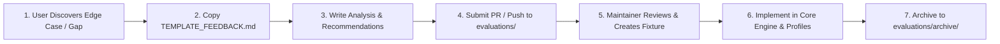
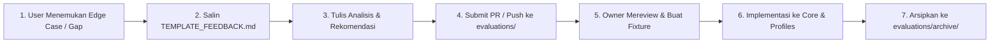

# 📋 Evaluation & Feedback Hub — UML-Architect

<p align="center">
  <a href="#-english"><b>English</b></a> •
  <a href="#-bahasa-indonesia"><b>Bahasa Indonesia</b></a>
</p>

---

## 🌐 English

Welcome to the **Evaluation & Feedback Hub** of `uml-architect`. This directory serves as a structured collaboration bridge between community users (*engineers/contributors*) and project maintainers.

When using the `uml-architect` AI skill or MCP server on a real-world enterprise codebase and encountering cases where diagrams are incomplete, method calls are truncated, or specific architectural patterns (e.g., reactive event sourcing, complex caching, multi-cloud storage) are missed, you can document and submit your evaluation here.

### 🔄 Evaluation Workflow



#### 1. For Users & Contributors:
1. Copy the evaluation template [`TEMPLATE_FEEDBACK.md`](./TEMPLATE_FEEDBACK.md).
2. Name your proposal file descriptively, for example:
   - `evaluations/FEEDBACK_DJANGO_CELERY_FLOW.md`
   - `evaluations/FEEDBACK_SPRING_WEBFLUX_REACTIVE.md`
   - `evaluations/FEEDBACK_NESTJS_MICROSERVICE_GRPC.md`
3. Fill out the sections:
   - **Executive Summary**: Tested controller/handler, runtime version, and architectural components.
   - **Code Characteristics vs Gaps**: Ground-truth flow vs what the engine missed.
   - **Tuning Recommendations**: Target rules in `profiles/*.json` or logic in `core/tracer.js` / `core/synthesizer.js`.
   - **Expected Ideal Output**: Expected Mermaid sequence or component diagram.
4. Submit a Pull Request (PR) or open an issue referencing the file.

#### 2. For Repository Maintainers:
1. Review the incoming evaluation document and analyze the gap.
2. Build a representative test fixture in `tests/fixtures/` using the provided code sample.
3. Apply required profile pattern additions or core engine traversal adjustments.
4. Run `npm test` to verify that 100% of unit and regression tests pass without side-effects.
5. Move the fulfilled evaluation proposal into [`evaluations/archive/`](./archive/) as an immutable reference of continuous improvement.

### 📂 Directory Layout

```
evaluations/
├── README.md                 # Bilingual guide (this file)
├── TEMPLATE_FEEDBACK.md      # Reusable RFC template for submitting evaluations
└── archive/                  # Fulfilled and verified evaluation proposals
    └── CASE_01_LARAVEL_CACHE_S3.md # Real-world Laravel multi-tier Redis & S3 study case
```

### 🌟 Gold Standard Reference

Check out our successfully fulfilled evaluation study case:  
👉 [`evaluations/archive/CASE_01_LARAVEL_CACHE_S3.md`](./archive/CASE_01_LARAVEL_CACHE_S3.md)  
*(Includes intra-class recursive crawling, AWS S3 object storage stereotyping, cache-aside pattern recognition, and Mermaid visual layer box grouping).*

---

## 🇮🇩 Bahasa Indonesia

Selamat datang di **Evaluation & Feedback Hub** `uml-architect`. Direktori ini dirancang khusus sebagai jembatan kolaborasi terstruktur antara pengguna (*users/engineers*) dan pemelihara repositori (*maintainers*).

Ketika Anda menggunakan skill atau MCP `uml-architect` pada basis kode nyata (*real-world codebase*) dan menemukan kasus di mana diagram kurang akurat, alur method terpotong, atau ada pola arsitektur baru yang belum dikenali (misal: event sourcing, cache-aside, multi-cloud storage), Anda dapat mendokumentasikan dan mengirimkan evaluasi Anda di sini.

### 🔄 Alur Kerja Evaluasi (Workflow)



#### 1. Untuk Pengguna / Kontributor:
1. Salin template evaluasi [`TEMPLATE_FEEDBACK.md`](./TEMPLATE_FEEDBACK.md).
2. Beri nama file baru yang deskriptif, contoh:
   - `evaluations/FEEDBACK_DJANGO_CELERY_FLOW.md`
   - `evaluations/FEEDBACK_SPRING_WEBFLUX_REACTIVE.md`
   - `evaluations/FEEDBACK_NESTJS_MICROSERVICE_GRPC.md`
3. Isi analisis sesuai petunjuk di template:
   - **Executive Summary**: Controller/handler yang diuji, versi framework, dan komponen arsitektur.
   - **Karakteristik Kode Riil vs Gap**: Alur sebenarnya vs bagian yang terlewat oleh engine.
   - **Rekomendasi Tuning Teknis**: Usulan rule di `profiles/*.json` atau engine di `core/tracer.js` / `core/synthesizer.js`.
   - **Ekspektasi Output Ideal**: Diagram visual Mermaid yang diharapkan.
4. Buat Pull Request (PR) atau buat issue dengan menyertakan file evaluasi tersebut.

#### 2. Untuk Repository Owner / Maintainer:
1. Pelajari dokumen evaluasi yang masuk dan pahami letak kesenjangannya.
2. Buat fixture uji representatif di `tests/fixtures/` berdasarkan cuplikan kode pada evaluasi.
3. Terapkan penyesuaian pada profil bahasa (`profiles/`) atau mesin pelacak (`core/`).
4. Jalankan `npm test` untuk memastikan *zero regression* (semua test lulus).
5. Pindahkan dokumen evaluasi yang selesai diimplementasikan ke dalam [`evaluations/archive/`](./archive/) sebagai riwayat kematangan fitur.

### 📂 Struktur Direktori

```
evaluations/
├── README.md                 # Panduan dwibahasa (file ini)
├── TEMPLATE_FEEDBACK.md      # Template RFC siap pakai untuk membuat evaluasi baru
└── archive/                  # Arsip evaluasi yang telah sukses diimplementasikan
    └── CASE_01_LARAVEL_CACHE_S3.md # Studi kasus Laravel multi-tier Redis & S3
```

### 🌟 Contoh Standar Emas (Reference Example)

Lihat studi kasus riil yang telah sukses diimplementasikan sebagai acuan:  
👉 [`evaluations/archive/CASE_01_LARAVEL_CACHE_S3.md`](./archive/CASE_01_LARAVEL_CACHE_S3.md)  
*(Mencakup analisis intra-class crawling, AWS S3 object storage, cache-aside alt blocks, dan Mermaid visual box layer grouping).*
