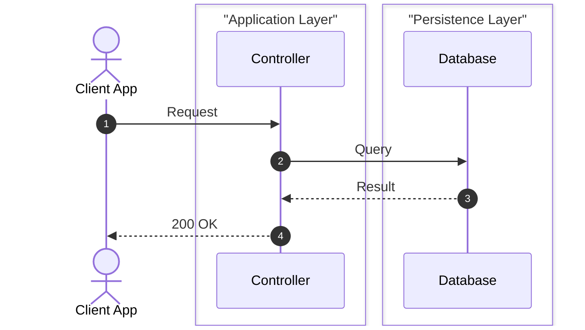

# [Nama Evaluasi]: Tuning & Enhancement Feedback

> **Judul Proposal**: [Misal: Deteksi Alur Django Celery Task / Go Fiber Webhook]  
> **Studi Kasus**: [Nama Controller / Handler / Service yang diuji]  
> **Bahasa & Framework**: [Misal: Python (Django/Celery), Go (Fiber), C# (.NET Core)]  
> **Author / Kontributor**: [@username]  
> **Tanggal**: YYYY-MM-DD  
> **Status**: Draft / In-Review / Ready for Implementation / Implemented  

---

## 1. Executive Summary

Jelaskan secara singkat latar belakang evaluasi:
- Apa kode yang diuji?
- Apa arsitektur dari kode tersebut (komponen database, cache, message broker, cloud storage, API pihak ketiga)?
- Apa masalah atau bagian diagram yang terlewat oleh engine saat ini?

---

## 2. Karakteristik Kode Riil vs Tantangan Tracer

### A. Cuplikan Kode Sumber (Representative Code)

```php
// Salin atau simplifikasi kode target yang dianalisis
```

### B. Tree Alur Sebenarnya (Ground Truth Execution Flow)

Gambarkan secara hierarkis alur yang seharusnya terjadi:

```
HTTP Request / Trigger
   │
   ▼
EntryPointFunction()
   ├── Step 1: Validasi / Auth
   ├── Step 2: Call ke internal helper / service
   │      └── Interaksi dengan DB / Cache / Cloud / External API
   └── Step 3: Return Response
```

### C. Kesenjangan yang Ditemukan (Gaps)
1. **Gap 1**: [Misal: Tracer tidak membaca helper method internal]
2. **Gap 2**: [Misal: Komponen X dilabeli sebagai Database generik, seharusnya Message Broker]
3. **Gap 3**: [Misal: Percabangan async/retry belum direpresentasikan sebagai loop/opt]

---

## 3. Usulan Rekomendasi Tuning Teknis

Tuliskan saran konkret bagian mana yang perlu diperbaiki:

### 🔧 Rekomendasi 1: Profil Bahasa (`profiles/<lang>.profile.json`)
* Penambahan pattern regex untuk framework atau library yang bersangkutan:
```json
{
  "infrastructureRecognition": {
    "feature_name": {
      "patterns": ["pattern_regex_here"],
      "participant": {
        "id": "CustomID",
        "alias": "Custom Label",
        "layer": "Nama Layer"
      }
    }
  }
}
```

### 🔧 Rekomendasi 2: Modifikasi Core Engine (`core/tracer.js` / `core/synthesizer.js`)
* Penyesuaian logika traversal, pattern recognition, atau grouping.

---

## 4. Contoh Output Ideal yang Diharapkan

Tuliskan diagram Mermaid yang seharusnya dihasilkan setelah tuning selesai:



---

## 5. Checklist Bagi Maintainer

| No | Target File | Tugas / Penyesuaian | Status |
|---|---|---|---|
| 1 | `profiles/<lang>.profile.json` | Tambahkan pattern pengenalan library X | [ ] Belum / [x] Selesai |
| 2 | `core/tracer.js` | Update logika pelacakan alur | [ ] Belum / [x] Selesai |
| 3 | `tests/fixtures/sample_<name>.<ext>` | Buat fixture uji representatif | [ ] Belum / [x] Selesai |
| 4 | `tests/test_all.js` | Tambahkan automated regression test | [ ] Belum / [x] Selesai |
