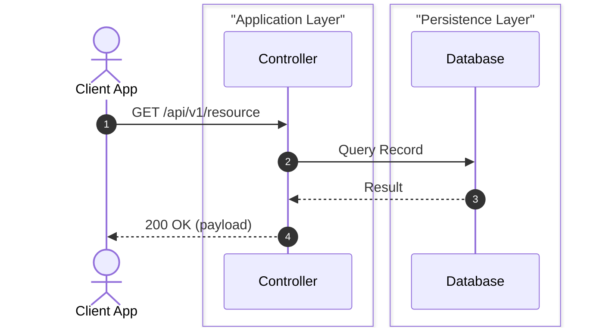

# [Evaluation Title]: Tuning & Enhancement Feedback RFC

> **Proposal Title**: [e.g., Support Django Celery Async Tasks / Go Fiber Webhook Flow]  
> **Target Case Study**: [e.g., Name of Controller / Handler / Service under test]  
> **Language & Framework**: [e.g., Python (Django/Celery), Go (Fiber), C# (.NET Core), Java (Spring Boot)]  
> **Author / Contributor**: [@username]  
> **Date**: YYYY-MM-DD  
> **Status**: Draft / In-Review / Ready for Implementation / Implemented  

---

## 1. Executive Summary

Provide a concise overview of the evaluation:
- What specific codebase or controller/endpoint was tested?
- What is the architecture of this component (e.g., relational DB, Redis cache, message broker, cloud object storage, external third-party API)?
- What critical interactions or branches did the current engine miss or misrepresent?

---

## 2. Real-World Code Characteristics vs Tracer Challenges

### A. Representative Code Snippet

```typescript
// Paste or simplify the target method and any relevant helper methods
```

### B. Ground-Truth Execution Flow (Actual Call Hierarchy)

Map out the actual execution tree that should ideally be traced:

```
HTTP Request / Trigger (Client)
   │
   ▼
EntryPointFunction()
   ├── Step 1: Input Validation / Authentication
   ├── Step 2: Call internal private helper / domain service
   │      └── Interaction with DB / Cache / Cloud Storage / External API
   └── Step 3: Return Final Response Payload
```

### C. Identified Gaps

1. **Gap 1**: [e.g., Tracer stops at shallow boundary and misses calls inside internal helper methods]
2. **Gap 2**: [e.g., Infrastructure component X is stereotyped as generic "Database" instead of "Message Broker"]
3. **Gap 3**: [e.g., Asynchronous retry or cache hit/miss branching is not structured as alt/opt blocks]

---

## 3. Proposed Technical Tuning Recommendations

Provide concrete suggestions on where adjustments are needed:

### 🔧 Recommendation 1: Language Profile (`profiles/<lang>.profile.json`)
* Add framework or library regex recognition patterns:

```json
{
  "infrastructureRecognition": {
    "feature_name": {
      "patterns": ["regex_pattern_here"],
      "participant": {
        "id": "CustomID",
        "alias": "Custom Display Label",
        "layer": "Architecture Layer Name"
      }
    }
  }
}
```

### 🔧 Recommendation 2: Core Engine Adjustments (`core/tracer.js` / `core/synthesizer.js`)
* Algorithmic improvements (e.g., deeper intra-class method traversal, custom alt/loop block synthesis, visual layer grouping).

---

## 4. Target Ideal Output Diagram (Mermaid)

Provide the ideal sequence or component diagram that should be produced once tuned:



---

## 5. Maintainer Implementation Checklist

| No | Target File | Task / Enhancement | Status |
|---|---|---|---|
| 1 | `profiles/<lang>.profile.json` | Add recognition patterns for library/framework | [ ] Pending / [x] Done |
| 2 | `core/tracer.js` | Enhance call-graph traversal / branching logic | [ ] Pending / [x] Done |
| 3 | `tests/fixtures/sample_<name>.<ext>` | Create representative reproducible test fixture | [ ] Pending / [x] Done |
| 4 | `tests/test_all.js` | Add automated regression test case | [ ] Pending / [x] Done |
