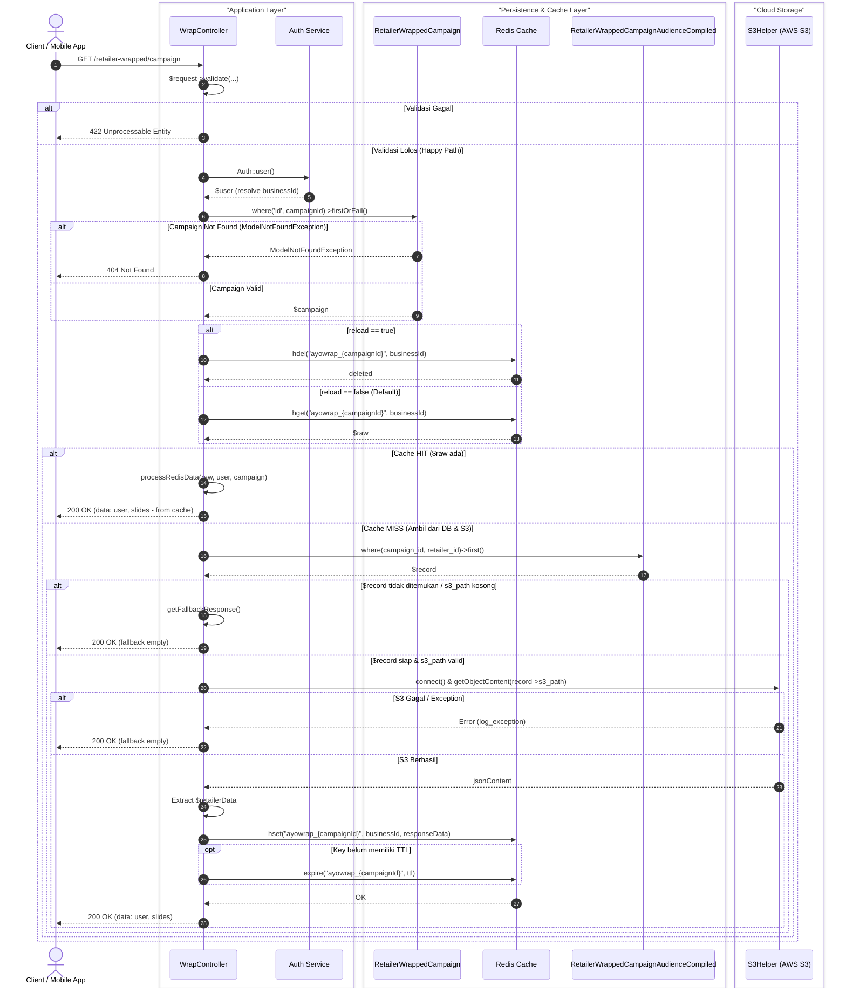

# Evaluasi #01: Multi-Tier Laravel Controller (Cache-Aside & AWS S3)

> **Judul Proposal**: Tuning Engine Tracer untuk Multi-Tier Controller, Cache-Aside Pattern, dan AWS S3  
> **Studi Kasus**: `WrapController::index()` (Laravel REST API)  
> **Bahasa & Framework**: PHP (Laravel 10+)  
> **Author / Kontributor**: Core Engineering Team  
> **Tanggal**: 2026-09-04  
> **Status**: ✅ **Implemented & Verified (v1.0.0)**  

---

## 1. Executive Summary

Evaluasi dilakukan dengan menguji pembuatan **Sequence Diagram** pada controller backend enterprise nyata (`WrapController::index()`).

Karakteristik arsitektur:
- Penggunaan **multi-tier infrastructure** (Relational DB, In-memory Cache Redis, dan AWS S3 Object Storage).
- Pola **Cache-Aside** dengan invalidasi dinamis (`$reload` / `hdel`).
- Pemecahan alur ke dalam **private helper methods** internal kelas (`fetchAndProcessS3Data`, `getS3Data`, `saveToRedis`).
- Strategi **graceful fallback** jika data tidak ditemukan atau storage gagal.

Hasil evaluasi menunjukkan bahwa jika tracer hanya melakukan *shallow parsing* pada satu method target, sebagian besar interaksi penting (terutama AWS S3 dan penyimpanan Redis) akan hilang.

---

## 2. Karakteristik Kode Riil vs Tantangan Tracer

```
HTTP Request (Client)
   │
   ▼
WrapController::index()
   ├── Request Validation ($request->validate)
   ├── Identity Resolution (Auth::user() -> businessId)
   ├── Campaign Verification (RetailerWrappedCampaign::where()->firstOrFail())
   │      └── [Exception Catch: 404 Not Found]
   ├── Redis Cache Check (Redis::hget / Redis::hdel)
   │      ├── [Cache HIT] ──► $this->processRedisData() ──► Return 200 OK
   │      └── [Cache MISS]
   │             │
   │             ▼
   │      $this->fetchAndProcessS3Data()
   │             ├── DB Query (RetailerWrappedCampaignAudienceCompiled)
   │             ├── $this->getS3Data() ──► S3Helper::getObjectContent() [AWS S3]
   │             ├── $this->getUserMetadata()
   │             ├── $this->saveToRedis() ──► Redis::hset() + Redis::expire()
   │             └── Return 200 OK (atau $this->getFallbackResponse())
```

### Kesenjangan yang Ditemukan (Gaps):
1. **Shallow vs Deep Method Call**: Logika S3 dan audience compiled DB tidak berada langsung di dalam body `index()`, melainkan didelegasikan ke `$this->fetchAndProcessS3Data()`.
2. **Stereotipe Partisipan yang Terlalu Umum**: Semua I/O dilabeli "Database", padahal Redis dan AWS S3 memiliki peran arsitektural berbeda.
3. **Pola Branching**: Pola *Cache Hit vs Cache Miss* bukan sekadar `if-else` biasa, melainkan pola arsitektural *Cache-Aside* yang membutuhkan blok `alt` terstruktur.

---

## 3. Rekomendasi Tuning Teknis & Implementasi

### 🔧 Rekomendasi 1: Recursive Intra-Class Method Crawling (`core/tracer.js`)
Implementasi fungsi `crawlLocalMethods()` dan `extractMethodBody()` untuk menelusuri `$this->method()` hingga kedalaman 2 level.

### 🔧 Rekomendasi 2: Penajaman Stereotipe Infrastruktur (`profiles/php.profile.json`)
Pemetaan pola:
- `Redis::` / `Cache::` $\rightarrow$ `Redis Cache` (`Persistence & Cache Layer`)
- `S3Helper` / `Storage::disk('s3')` $\rightarrow$ `S3Helper (AWS S3)` (`Cloud Storage`)
- `Auth::user()` $\rightarrow$ `Auth Service` (`Application Layer`)

### 🔧 Rekomendasi 3: Pola Cache-Aside & Invalidation (`core/tracer.js`)
- `alt reload == true` $\rightarrow$ `Redis::hdel`
- `else reload == false` $\rightarrow$ `Redis::hget`
- `alt Cache HIT` $\rightarrow$ return cached data
- `else Cache MISS` $\rightarrow$ query DB $\rightarrow$ S3 fetch $\rightarrow$ `Redis::hset` + `expire` $\rightarrow$ return fresh data

### 🔧 Rekomendasi 4: Visual Boundary dengan Mermaid & PlantUML `box` (`core/synthesizer.js`)
Mengelompokkan partisipan ke dalam visual boxes:
- `box "Application Layer" #1e293b`
- `box "Persistence & Cache Layer" #0f172a`
- `box "Cloud Storage" #1e1e2e`

### 🔧 Rekomendasi 5: Granularitas Bertingkat (`detail_level`: L1, L2, L3)
- L1: Conceptual flow.
- L2: Full architecture flow.
- L3: Deep technical flow dengan `Note over` untuk key format dan TTL kalkulasi.

---

## 4. Output Ideal yang Berhasil Dihasilkan



---

## 5. Checklist Hasil Implementasi

| No | Target File | Tugas / Penyesuaian | Status |
|---|---|---|---|
| 1 | `profiles/php.profile.json` | Pola `Redis::`, `Cache::`, `S3Helper`, `Storage::disk` | ✅ Selesai |
| 2 | `core/tracer.js` | Local method crawler `crawlLocalMethods()` | ✅ Selesai |
| 3 | `core/tracer.js` | Deteksi Cache-Aside (`hget` -> hit/miss -> `hset`/`expire`) | ✅ Selesai |
| 4 | `core/synthesizer.js` | Sintaks Mermaid & PlantUML `box "Layer Name"` | ✅ Selesai |
| 5 | `core/synthesizer.js` | Filter tingkat detail (`L1`, `L2`, `L3`) | ✅ Selesai |
| 6 | `tests/fixtures/sample_laravel_cache_s3.php` | Test fixture representatif | ✅ Selesai |
| 7 | `tests/test_all.js` | Automated regression test (17/17 lulus) | ✅ Selesai |
